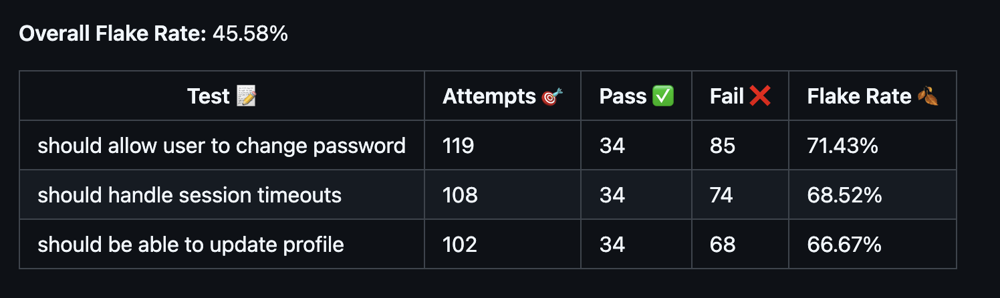
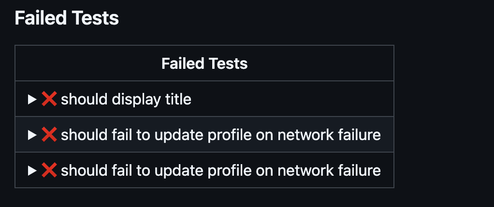
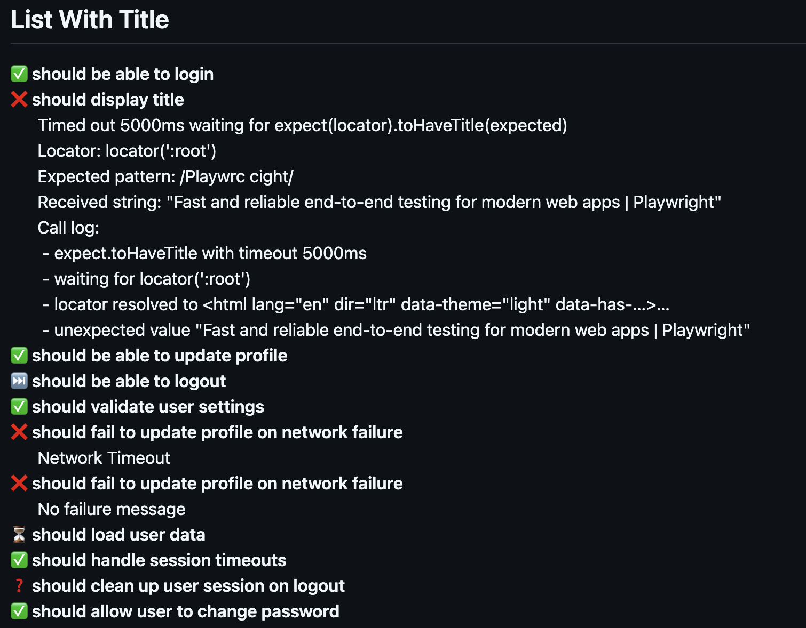
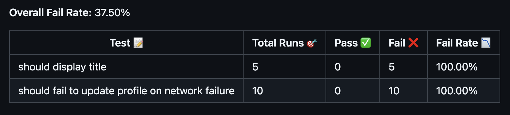
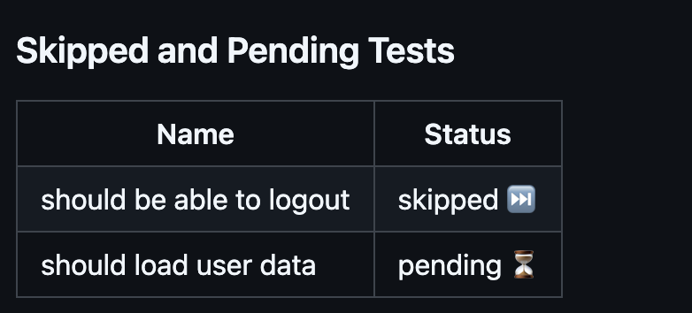

# Publish and View Test Results Reports in Github Actions

> Integrate Test Reporting into Your GitHub Actions Workflow

A GitHub test reporting tool that supports all major testing frameworks.
Generate, publish and alert your team with detailed test results, including
summaries, in-depth reports, failed test analyses, flaky test detection and AI
analyses directly within your GitHub Actions CI/CD workflow and Pull Requests.

Choose from a variety of pre-built views or create custom views tailored to your
project's needs, ensuring that test results are always where you need them.

## **⭐⭐ If you find this project useful, consider giving it a GitHub star ⭐⭐**

## You can help us grow

Support our mission to enhance test reporting in Github Actions by:

- **⭐ Starring this repository to show your support. ⭐**
- **🙌 Following our [GitHub page here](https://github.com/ctrf-io) to stay
  updated. 🙌**

Thank you! Your support is invaluable to us! 💙

## Key Features

- **Seamless Test Result Integration:** View and publish test results directly
  within the GitHub Actions workflow summary.
- **Automated PR Comments:** Post any views as as comments on GitHub Pull
  Requests automatically, including custom.
- **Many View Options:** Access a variety of views, including Test Summary,
  Historical, Detailed Test Results, Failed Tests Overview, and Flaky Tests
  Analysis.
- **View AI summaries**: View AI generated summaries to help resolve failed
  tests.
- **Build Your Own Reports:** Build and customize your own test summary reports
  to fit specific project requirements.
- **Broad Framework Support:** Compatible with all major testing frameworks
  through standardized CTRF reports.
- **Easy Setup and Use:** Run the tool with a simple command: npx
  github-actions-ctrf your-report.json.
- **Merge Multiple Test Reports:** If your framework generates multiple reports,
  merge them into a single report.

## Visual Overview

|                    |        |  |          |                  |
| :--------------------------------------: | :----------------------------------------: | :----------------------------------: | :--------------------------: | :----------------------------------: |
|  |  |          |  |  |

## Usage


[](https://github.com/ctrf-io/github-actions-ctrf/actions/workflows/main.yaml)


Add to your Github Actions workfile file:

```bash
npx github-actions-ctrf path-to-your-ctrf-report.json
```

Before using the commands, ensure that your GitHub Actions runner has Node.js
installed.

Generate a CTRF report using your testing framework.
[CTRF reporters](https://github.com/orgs/ctrf-io/repositories) are available for
most testing frameworks and easy to install.

**No CTRF reporter? No problem!**

Use [junit-to-ctrf](https://github.com/ctrf-io/junit-to-ctrf) to convert a JUnit
report to CTRF

### Full example

```yaml
name: Example workflow file

on: [push]

jobs:
  testing:
    runs-on: ubuntu-latest
    steps:
      - name: Checkout code
        uses: actions/checkout@v4
      - name: Generate Report
        run: npx github-actions-ctrf path-to-your-ctrf-report.json
        if: always()
```

### Generating All Tables

For all general tables, add the following command to your workflow YAML:

```yaml
- name: Publish CTRF Test Summary Results
  run: npx github-actions-ctrf path-to-your-ctrf-report.json
  if: always()
```

### Generating Test Summary Table

For a test summary table, add the `summary` command to your workflow yaml:

```yaml
- name: Publish CTRF Test Summary Results
  run: npx github-actions-ctrf summary path-to-your-ctrf-report.json
  if: always()
```

### AI Summary

For a AI summary table, add the `ai` command to your workflow yaml:

```yaml
- name: Publish CTRF AI Test Summary Results
  run: npx github-actions-ctrf ai path-to-your-ctrf-report.json
  if: always()
```

To generate an AI summary checkout the
[AI Test Reporter](https://github.com/ctrf-io/ai-test-reporter)

### Generating Detailed Test Table

For a test details table, add the `tests` command to your workflow yaml:

```yaml
- name: Publish CTRF Detailed Test Summary Results
  run: npx github-actions-ctrf tests path-to-your-ctrf-report.json
  if: always()
```

### Generating Test list

For a simple list of tests, add the `test-list` command to your workflow yaml:

```yaml
- name: Publish CTRF test list
  run: npx github-actions-ctrf test-list path-to-your-ctrf-report.json
  if: always()
```

### Generating Failed Test Details Table

For a failed test details table, add the `failed` command to your workflow yaml:

```yaml
- name: Publish CTRF Failed Test Summary Results
  run: npx github-actions-ctrf failed path-to-your-ctrf-report.json
  if: always()
```

### Generating Failed Folded Test Details Table

For a failed test table with details folded, add the `failed-folded` command to
your workflow yaml:

```yaml
- name: Publish CTRF Failed Test Summary Results
  run: npx github-actions-ctrf failed-folded path-to-your-ctrf-report.json
  if: always()
```

### Generating Failed Rate Test Details Table

To see the failed test rate over time, add the `failed-rate` command to your
workflow yaml:

```yaml
- name: Publish CTRF Flaky Test Summary Results
  run: npx github-actions-ctrf failed-rate path-to-your-ctrf-report.json
  if: always()
  env:
    GITHUB_TOKEN: ${{ secrets.GITHUB_TOKEN }}
```

Requires artifact upload

### Generating Flaky Test Details Table

To see which tests were flaky in this run, add the `flaky` command to your
workflow yaml:

```yaml
- name: Publish CTRF Flaky Test Summary Results
  run: npx github-actions-ctrf flaky path-to-your-ctrf-report.json
  if: always()
```

### Generating Flaky Rate Test Details Table

To see the flakiness of your tests over time, add the `flaky-rate` command to
your workflow yaml:

```yaml
- name: Publish CTRF Flaky Rate Test Summary Results
  run: npx github-actions-ctrf flaky-rate path-to-your-ctrf-report.json
  if: always()
  env:
    GITHUB_TOKEN: ${{ secrets.GITHUB_TOKEN }}
```

Requires artifact upload

### Generating skipped Test Details Table

To see which tests were skipped or pending, add the `skipped` command to your
workflow yaml:

```yaml
- name: Publish CTRF Skipped Test Summary Results
  run: npx github-actions-ctrf skipped path-to-your-ctrf-report.json
  if: always()
```

### Generating Suite Folded Table

To see which tests grouped by suite with tests folded, add the `suite-folded`
command to your workflow yaml:

```yaml
- name: Publish CTRF Suite Folded Summary
  run: npx github-actions-ctrf suite-folded path-to-your-ctrf-report.json
  if: always()
```

Groups by filePath by default, add argument `--useSuite` to use suite property

### Generating Suite List

To see which tests grouped by suite with tests listed, add the `suite-list`
command to your workflow yaml:

```yaml
- name: Publish CTRF Suite Folded Summary
  run: npx github-actions-ctrf suite-list path-to-your-ctrf-report.json
  if: always()
```

Groups by filePath by default, add argument `--useSuite` to use suite property

### Generating Previous Tests Table

To see results from previous tests, add the `historical` command to your
workflow yaml:

```yaml
- name: Publish CTRF Historical results table
  run: npx github-actions-ctrf historical path-to-your-ctrf-report.json
  if: always()
  env:
    GITHUB_TOKEN: ${{ secrets.GITHUB_TOKEN }}
```

Requires artifact upload

### Generating a Custom Report

To use a custom summary using a handlebars template, add the `custom` command to
your workflow:

```yaml
- name: Publish CTRF Custom summary
  run:
    npx github-actions-ctrf custom path-to-your-ctrf-report.json
    path-to-your-handlebars-template.hbs
  if: always()
```

### Generating a Community Built Report

To use a community built report, add the `community` command to your workflow
and the name of the report template:

```yaml
- name: Publish CTRF Community Report
  run:
    npx github-actions-ctrf community path-to-your-ctrf-report.json
    report-template-name
  if: always()
```

See the available [community reports](community-reports), or
[add your own](#how-to-contribute-your-own-reports).

### Post a Pull Request Comment

To post a comment on the pull request with test results, add the `pull-request`
command to your workflow:

```yaml
- name: Publish CTRF pull request comment
  run: npx github-actions-ctrf pull-request path-to-your-ctrf-report.json
  if: always()
  env:
    GITHUB_TOKEN: ${{ secrets.GITHUB_TOKEN }}
```

### Generating Fail annotations

For test annotations, add the `annotate` argument to your workflow yaml:

```yaml
- name: Annotate failed tests
  run: npx github-actions-ctrf annotate path-to-your-ctrf-report.json
  if: always()
```

## Options

- `--title`: Title of the summary.
- `--annotate`: annotate failed tests.
- `--domain`: Base URL for GitHub Enterprise Server
- `--pull-request`: Post a Pull Request comment with the summary
- `--on-fail-only`: Post a Pull Request comment only if there are failed tests
- `--exit-on-fail`: Sets the action status to failed when a failed tests is
  found
- `--use-suite-name`: Prefix test name with suite name

## Storing Artifacts

Some views require you to store CTRF reports as artifacts:

This ensures that the test results are available for future runs.

```yaml
- name: Upload test results
  uses: actions/upload-artifact@v4
  with:
    name: ctrf-report
    path: path-to-your-ctrf-report.json
```

## Merge reports

You can merge reports if your chosen reporter generates multiple reports through
design, parallelisation or otherwise.

The [ctrf-cli](https://github.com/ctrf-io/ctrf-cli) package provides a method to
merge multiple ctrf json files into a single file.

After executing your tests, use the following command:

```sh
npx ctrf merge <directory>
```

Replace directory with the path to the directory containing the CTRF reports you
want to merge.

## Pull Requests

There are two ways you can post comments on pull requests.

The first is by using the `pull-request` method, which uses a standard pull
request view:

```yaml
- name: Publish CTRF pull request comment
  run: npx github-actions-ctrf pull-request path-to-your-ctrf-report.json
  if: always()
  env:
    GITHUB_TOKEN: ${{ secrets.GITHUB_TOKEN }}
```

Additionally, you can post a pull request comment with your chosen view, like
`flaky-rate`, by adding the `pull-request` argument to your command:

```yaml
- name: Post PR Comment
  run: npx github-actions-ctrf flaky-rate ctrf-report.json --pull-request
  if: always()
  env:
    GITHUB_TOKEN: ${{ secrets.GITHUB_TOKEN }}
```

The `pull-request` argument works with all views.

To post a pull request comment only when tests fail, add the `--on-fail-only`
argument to your command.

The GITHUB_TOKEN is typically available by default in GitHub Actions, but it
needs to have write permissions for pull requests. For guidance on configuring
these permissions, please see GitHub's
[documentation](https://docs.github.com/en/actions/security-for-github-actions/security-guides/automatic-token-authentication#permissions-for-the-github_token)
or
[GitHub Enterprise Server documentation](https://docs.github.com/en/enterprise-server@3.14/actions/security-for-github-actions/security-guides/automatic-token-authentication#about-the-github_token-secret)

### Comment Management Inputs

`--update-comment` (optional, boolean) If true and an existing tagged comment is
found, the new report is appended to it. Otherwise, a new comment is created.

`--overwrite-comment` (optional, boolean) If true and an existing tagged comment
is found, that comment’s entire content is replaced with the new report.
Otherwise, a new comment is created.

`--comment-tag` (optional, string) A unique identifier for comments posted. Used
to find and update/overwrite existing comments.

These options provide flexibility in how you manage comments. For example, you
can continually update or overwrite a single comment or create separate comments
per workflow or job.

For example, the following command creates or updates a comment tagged with the
current workflow and job names:

`npx github-actions-ctrf pull-request path-to-your-ctrf-report.json --update-comment --comment-tag "${{ github.workflow }}-${{ github.job }}"`

## Previous Test Results

### Filtering

Filtering is applied as follows:

- Runs from the same branch for events of type push and schedule from the same
  workflow id
- Runs from the same pull request for events of type pull_request from the same
  workflow id

This ensures that you only see workflow runs that are related to your current
branch or pull request

### Available Options

The Historical table method comes with several options to customize the output:

- `--rows`: Specifies the number of historical test result rows to show in the
  table. The default value is 10.

- `--artifact-name`: Sets the name of the artifact where the CTRF report is
  stored. The default name is ctrf-report.

## Generating an AI summary

You can generate human-readable AI summary for your failed tests using models
from the leading AI providers by using the
[AI Test Reporter](https://github.com/ctrf-io/ai-test-reporter)

## Custom summary

The custom summary method lets you define how the Github Actions summary or PR
comment is presented by using a Handlebars template. The template can include
any markdown content and leverage data from your CTRF report and GitHub
properties, allowing for dynamic and customizable output.

### How to Use the Custom Summary Command

To use the `custom` summary method, you need to pass two arguments:

- **CTRF Report File:** The path to your CTRF report file, which contains the
  results of your tests.
- **Handlebars Template File:** The path to a Handlebars file that contains the
  markdown template.

add the following to your workflow yaml:

```yaml
- name: Publish CTRF Custom summary
  run:
    npx github-actions-ctrf custom path-to-your-ctrf-report.json
    path-to-your-handlebars-template.hbs
  if: always()
```

### Build Your Own Report

Creating a Handlebars markdown template allows you to have full control over how
your test results are displayed. With Handlebars and CTRF, you can inject
dynamic content into your markdown files, making your summaries flexible and
informative.

### Handlebars Basics

Handlebars is a simple templating language that lets you insert data into your
markdown in a declarative way. You can use placeholders, conditionals, and loops
to dynamically generate content based on your test results.

### Example of a Simple Handlebars Template

Here's a basic example of a Handlebars markdown template that you might use to
generate a custom summary:

```hbs
# Custom Test Summary **Total Tests**:
{{ctrf.summary.tests}}
**Passed**:
{{ctrf.summary.passed}}
**Failed**:
{{ctrf.summary.failed}}
**Flaky Tests**:
{{countFlaky ctrf.tests}}
**Duration**:
{{formatDuration ctrf.summary.start ctrf.results.summary.stop}}
```

### Special Handlebars Helpers

When writing your template, you can use several special Handlebars helpers:

- `{{countFlaky ctrf.tests}}`: Counts and returns the number of flaky tests.

- `{{formatDuration ctrf.summary.start ctrf.summary.stop}}`: Formats the
  duration between start and stop times into a human-readable string.

- `{{stripAnsi message}}`: Strips ANSI from string, useful for when error
  messages contain ANSI characters.

- `{{eq arg1 arg2}}`: Compares two arguments and returns true if they are equal.

See available helpers [here](src/handlebars/helpers).

We welcome contributions for additional helpers.

### Available Properties

All CTRF properties are accessible via the ctrf property in your template.

Additionally, you can access properties from GitHub using the github property.
The following GitHub properties are available:

- `github.repoName`: The name of the repository.
- `github.branchName`: The current branch being worked on or checked out.
- `github.runNumber`: The unique number assigned to each run in the workflow.
  Increments with every run.
- `github.jobName`: The name of the specific job being executed within the
  workflow.
- `github.workflowID`: The unique ID assigned to the workflow, providing a way
  to track it.
- `github.workflowName`: The name of the workflow being executed.
- `github.actorName`: The user or entity responsible for triggering the
  workflow. This could be a human user or a bot.
- `github.eventName`: The event that triggered the workflow (e.g., push,
  pull_request, schedule).
- `github.runID`: A unique ID representing the run of the workflow for
  traceability.
- `github.pullRequestNumber`: The number associated with the pull request if the
  event triggering the workflow is a pull request.
- `github.apiURL`: The base URL for accessing the repository’s API.
- `github.baseURL`: The root URL of the repository.
- `github.buildURL`: The URL for the build, typically where you can view build
  logs and details.

### Template Example

For inspiration on what you can create, check out the
[built-in reports](src/reports) and [community reports](community-reports)

### Community Reports

We welcome and encourage contributions of community-built reports. Community
reports allow users to share custom Handlebars templates designed for specific
use cases or unique report styles.

#### How To Contribute Your Own Reports

1. **Fork the Repository**  
   Start by forking this repository to your GitHub account.

2. **Create a New Report Folder**  
   Navigate to the `community-reports` directory and create a new folder named
   after your report (e.g., `my-custom-report`).

3. **Include the Following Files**  
   Your report folder should include:

   - **`my-custom-report.hbs`**: Your Handlebars template file. This is the core
     of your report.
   - **`README.md`**: Documentation about your report. Include the following
     details:
     - The purpose of your template.
     - Instructions on how to use it.
     - Any important considerations (e.g., required CTRF report properties).
     - Example output

4. **Submit a Pull Request**  
   Once your report is ready, submit a pull request with a brief description of
   your contribution. We will review it and provide feedback if necessary.

#### Guidelines for Creating a Good Community Report

- **Be Descriptive**: Ensure your `README.md` clearly explains the report's
  purpose, usage, and any special requirements.
- **Follow the Template Structure**: Maintain consistency with other community
  reports in the repository.
- **Keep It Useful**: Focus on templates that solve common problems or address
  specific needs.

## Calculations

### Flaky Rate

The flaky rate measures how often tests exhibit flaky behavior—tests that fail
initially but pass upon retry. This metric helps identify unstable tests that
may need attention to improve reliability. Using test retries is fundamental for
the detection of flaky tests with CTRF.

#### Calculation Method

Test Flaky Rate (%) is calculated by dividing the number of flaky occurrences by
the total number of test attempts (including retries) and multiplying by 100:

Flaky Rate (%) = (Flaky Occurrences ÷ Total Attempts) × 100

Overall Flaky Rate across all tests is calculated by summing the flaky
occurrences and total attempts of all tests:

Overall Flaky Rate (%) = (Total Flaky Occurrences of All Tests ÷ Total Attempts
of All Tests) × 100

### Failed Rate

The failed rate measures how often tests fail based on their final outcome,
disregarding any retries. This metric helps identify tests that consistently
fail, allowing you to prioritize fixes and enhance overall test reliability.

#### Calculation Method

Test Fail Rate (%) is calculated by dividing the fail count by the total runs
and multiplying by 100:

Fail Rate (%) = (Fail Count ÷ Total Runs) × 100

Overall Fail Rate across all tests is calculated by summing the fail counts and
total runs of all tests:

Overall Fail Rate (%) = (Total Fail Counts of All Tests ÷ Total Runs of All
Tests) × 100

## Alternative Installation Options

### Locking to a Specific Version with `npx`

The easiest way to run `github-actions-ctrf` is by using `npx`, which doesn't
require installation. By default, it runs the latest version. However, if you'd
like to lock to a specific version, you can do so by specifying the version:

```bash
npx github-actions-ctrf@1.2.3 path-to-your-ctrf-report.json
```

This command will download and run the specified version of
`github-actions-ctrf`.

### Local Installation in Your Node.js Project

For users who prefer installing the package locally to their project, you can
install `github-actions-ctrf` as a project dependency:

```bash
npm install github-actions-ctrf
```

This will install `github-actions-ctrf` into your `node_modules` folder, and you
can run it with the following command:

```bash
./node_modules/.bin/github-actions-ctrf path-to-your-ctrf-report.json
```

Alternatively, you can add a script to your `package.json` to simplify the
command:

```json
{
  "scripts": {
    "report": "github-actions-ctrf path-to-your-ctrf-report.json"
  }
}
```

Now, you can run:

```bash
npm run report
```

## Components

[Click here](https://github.com/ctrf-io/github-actions-ctrf/actions) to see the
Actions of this repository for a full example

### Summary


### Test details


### Test list



### Failed details


### Failed Folded details


### Failed rate



### AI summary


### Flaky details


### Flaky rate


### Skipped



### Suite folded


### Suite list


### Historical


### Pull Request


### Custom Summary


## What is CTRF?

CTRF is a universal JSON test report schema that addresses the lack of a
standardized format for JSON test reports.

**Consistency Across Tools:** Different testing tools and frameworks often
produce reports in varied formats. CTRF ensures a uniform structure, making it
easier to understand and compare reports, regardless of the testing tool used.

**Language and Framework Agnostic:** It provides a universal reporting schema
that works seamlessly with any programming language and testing framework.

**Facilitates Better Analysis:** With a standardized format, programatically
analyzing test outcomes across multiple platforms becomes more straightforward.

## Support Us

If you find this project useful, consider giving it a GitHub star ⭐ It means a
lot to us.
