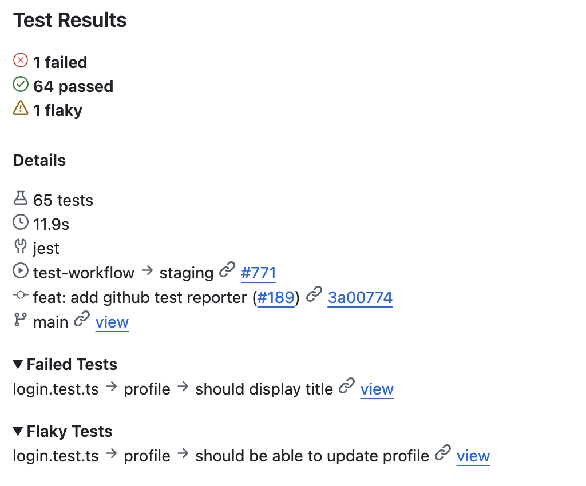
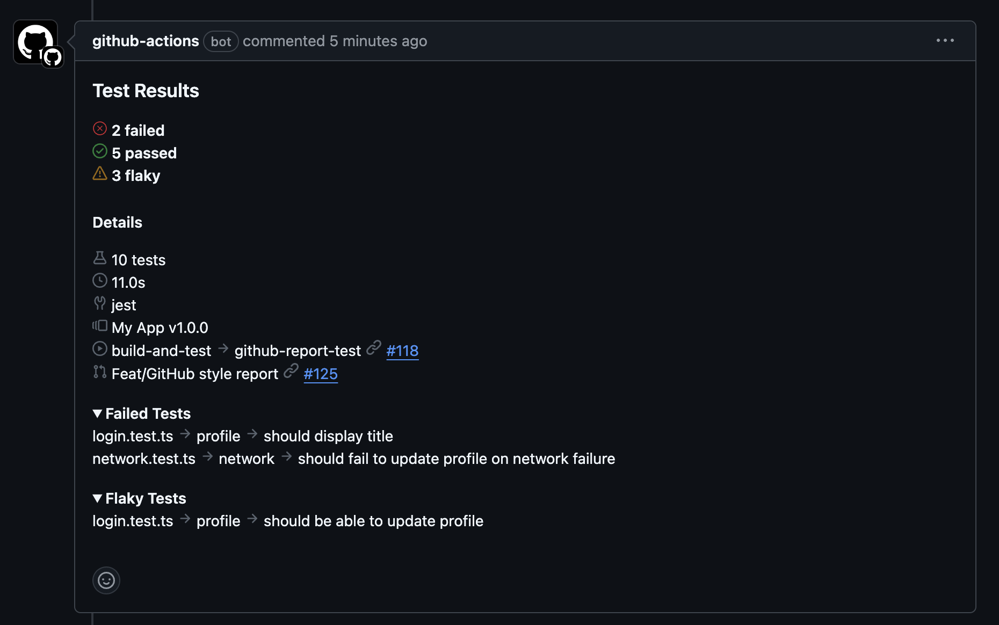
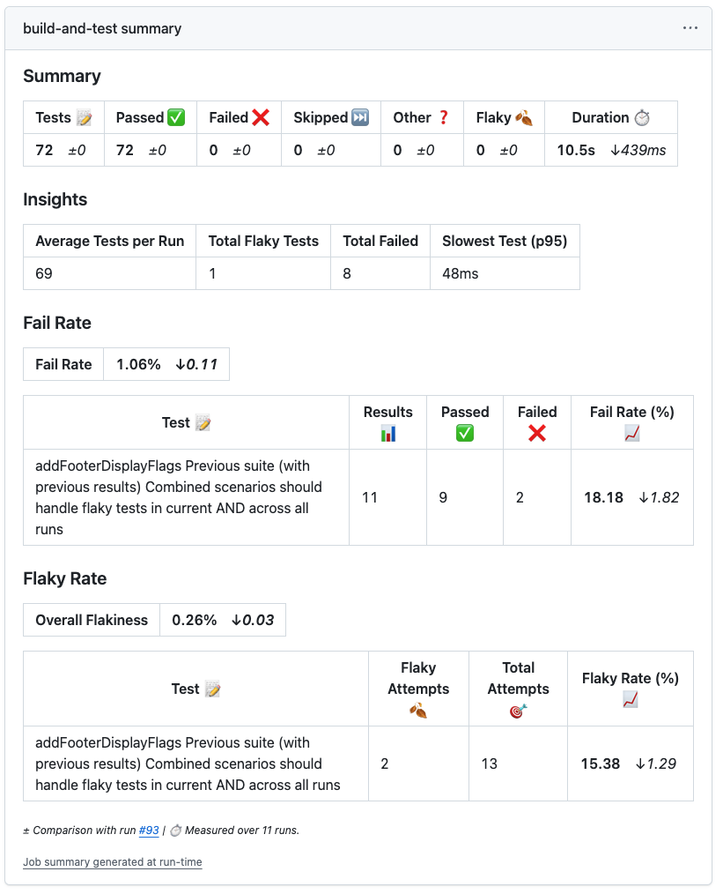
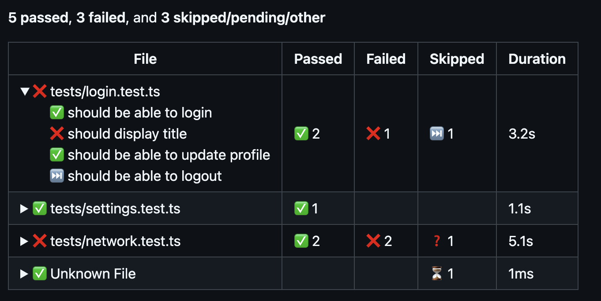
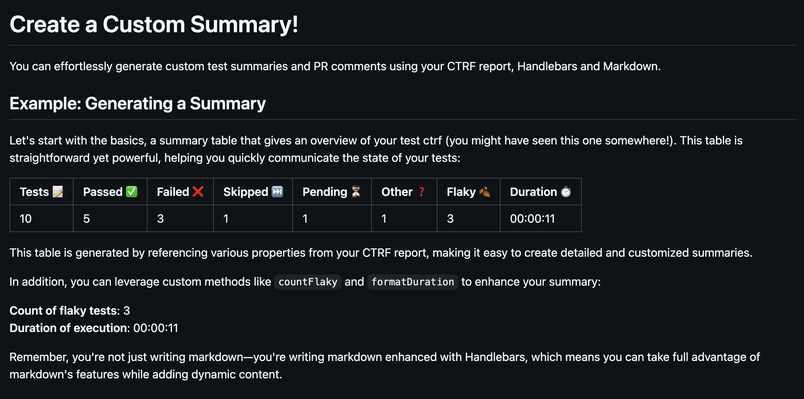
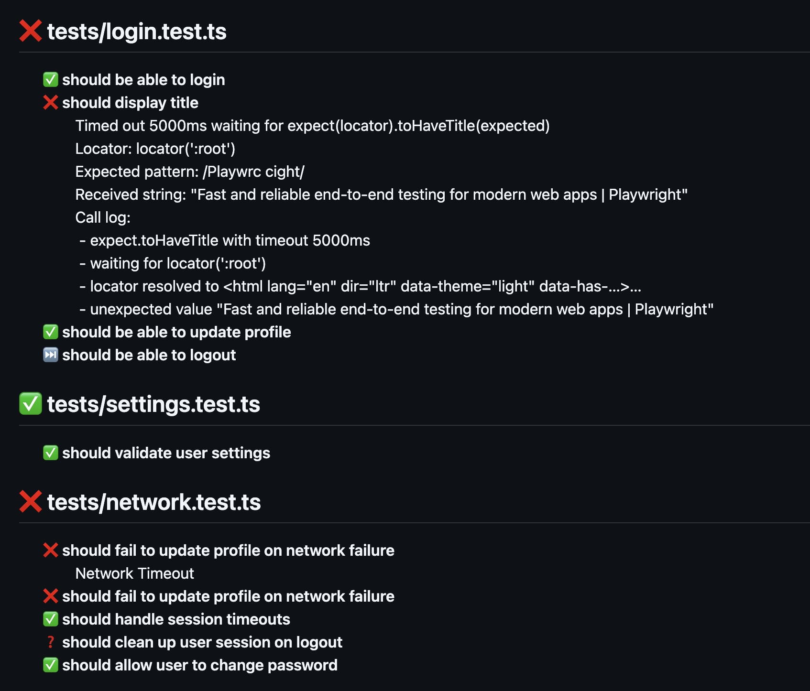

# Publish and View Test Results Reports in Github Actions

> Integrate Test Reporting into Your GitHub Actions Workflow

A GitHub test reporting tool that supports all major testing frameworks.
Generate, publish and alert your team with detailed test results, including
summaries, in-depth reports, failed test analyses, flaky test detection and AI
analyses directly within your GitHub Actions CI/CD workflow and Pull Requests.

Choose from a variety of pre-built reports or create custom reports tailored to
your project's needs, ensuring that test results are always where you need them.


<div align="center">
  <h2>⭐ Support Us ⭐</h2>
  <h3>If you like what you see, drop us a star ⭐</h3>
  <h3>It helps more teams find the project and motivates us to keep building! 💚</h3>
</div>


<div align="center">
<div style="padding: 1.5rem; border-radius: 8px; margin: 1rem 0; border: 1px solid #30363d;">
<span style="font-size: 23px;">💚</span>
<h3 style="margin: 1rem 0;">CTRF tooling is open source and free to use</h3>

<div style="margin-top: 1.5rem;">
<a href="https://github.com/ctrf-io/github-test-reporter">

</a>
<a href="https://github.com/ctrf-io">

</a>
</div>
</div>

<p style="font-size: 14px; margin: 1rem 0;">
Contributions are very welcome! <br/>
Explore more <a href="https://www.ctrf.io/integrations">integrations</a>
</p>
</div>

## Example

<div align="center">

</div>

## Key Features

**🧩 Post anywhere:** job summaries, pull requests, checks, issues, inline annotations, and other developer tools

**📊 Built-in insights:** failures, flaky tests, and trends across hundreds of runs

**🧘 Super flexible:** start fast with powerful built-in reports or go fully custom with your own templates

**🤖 AI-powered analysis:** explains why tests failed and how to fix them

**🔌 Framework-agnostic:** works with any testing tool

## Table of Contents

1. [Usage](#usage)
2. [Report Showcase](#report-showcase)
3. [Visual Overview](#visual-overview)
4. [Available Inputs](#available-inputs)
5. [Pull Requests](#pull-requests)
6. [Status Checks](#status-checks)
7. [Build Your Own Report](#build-your-own-report)
8. [Customizing Report Order](#customizing-report-order)
9. [Community Reports](#community-reports)
10. [GitHub Token](#github-token)
11. [Storing Artifacts](#storing-artifacts)
12. [Filtering](#filtering)
13. [Integrations](#integrations)
14. [Generating an AI Report](#generating-an-ai-report)
15. [What is CTRF?](#what-is-ctrf)

## Usage

To get started add the following to your workflow file:

```yaml
- name: Publish Test Report
  uses: ctrf-io/github-test-reporter@v1
  with:
    report-path: './ctrf/*.json'
    github-report: true
  if: always()
```

## Report Showcase

Checkout all the built-in reports [here](docs/report-showcase.md)

## Visual Overview

|                    |         |  |         |                  |
| :--------------------------------------: | :----------------------------------------: | :----------------------------------: | :--------------------------: | :----------------------------------: |
|  |  |          |  |  |

## Generate a report

You need a CTRF or JUnit report.

This reporter works best with a CTRF as it's packed with modern properties. [CTRF reporters](https://ctrf.io/integrations) are available for most testing frameworks and easy to install.

For more details on using JUnit, see [JUnit integration instructions](docs/integrations.md#junit-to-ctrf-integration)

## Available Inputs

For more advanced usage, there are several inputs available.

```yaml
- name: Publish Test Report
  uses: ctrf-io/github-test-reporter@v1
  with:
    # Core Configuration
    report-path: './ctrf/*.json' # Path or glob pattern to the CTRF report JSON file.
    template-path: './templates/custom-summary.hbs' # Path to the Handlebars template for customizing markdown output.

    # Reports - Choose as many as you like. Default is false. Choosing none will use default reports.
    summary-report: true
    summary-delta-report: false
    github-report: false
    test-report: false
    test-list-report: false
    failed-report: false
    fail-rate-report: false
    flaky-report: false
    flaky-rate-report: false
    failed-folded-report: false
    previous-results-report: false
    insights-report: false
    slowest-report: false
    ai-report: false
    skipped-report: false
    suite-folded-report: false
    suite-list-report: false
    file-report: false
    pull-request-report: false
    commit-report: false
    custom-report: false
    community-report: false

    # Behavior Options
    summary: true # Post report to the job summary. Default is true
    pull-request: false # Comment on pull request with report. Default is false
    issue: '' # Issue number to comment on. Works with standard issues and pull-request. Default is no issue
    status-check: false # Create a status check for the workflow. Default is false
    status-check-name: 'Test Reporter Results' # Name of the status check. Default is GitHub Test Reporter Results 
    community-report-name: 'summary-short' # Name of the community report to use. Default is summary-short
    title: '' # Set a custom title to display on the report.
    annotate: true # Add failed test annotations. Default is true
    on-fail-only: false # Add a pull request comment only if tests fail. Default is false
    exit-on-no-files: false # Exit the workflow with a failure status if no test files are found. Default is false
    exit-on-fail: false # Exit the workflow with a failure status if any tests fail. Default is false
    exit-on-empty: false # Exit the workflow with a failure status if no tests are found. Default is false
    use-suite-name: false # Prefix test names with the suite name for better grouping. Default is false
    collapse-large-reports: false # Collapse large reports (test-table and test-list) for better readability. Default is false
    update-comment: false # Update existing Pull Request comment. Default is false
    overwrite-comment: false # Overwrite existing Pull Request comment. Default is false
    always-latest-comment: false # Create a new comment if the existing comment is not the latest in the thread. Default is false
    comment-tag: false # Tag to match Pull Request comment
    write-ctrf-to-file: 'ctrf/ctrf-report.json' # Path to write the internal processed CTRF report for future processing. Default no write
    upload-artifact: true # Upload to workflow artifact the processed CTRF report for future processing. Default false

    # Advanced Options
    artifact-name: 'ctrf-report' # Name of the artifact containing test reports. Default is ctrf-report
    previous-results-max: 10 # Maximum number of previous test results to display in the report. Default is 10
    fetch-previous-results: false # Always fetch previous workflow runs when using custom templates. Default is false
    max-workflow-runs-to-check: 400 # Maximum number of workflow runs to check for previous results. Default is 400
    max-previous-runs-to-fetch: 100 # Maximum number of previous runs to fetch and process for metrics and reports. Default is 100
    baseline: 1 # Baseline report to use for metrics comparison. Number = previous n reports, string = reportId.' Default is 1 (last run)
    baseline-report-path: 'path/to/baseline/report.json' # Path to a specific CTRF report to use as a baseline.'
    group-by: 'filePath' # Specify grouping for applicable reports (e.g., suite or file path). Default is filePath
    always-group-by: false # Force grouping by suite or file path for all reports. Default is false
    report-order: 'summary-report,failed-report,flaky-report,skipped-report,test-report' # Comma-separated list of report types to specify the order in which reports should be displayed
    integrations-config: '{}' # JSON configuration for integrations with other developer tools
  if: always()
```

Only `report-path` is required.

## Pull Requests

You can add a pull request comment by using the `pull-request-report` input:

```yaml
- name: Publish Test Report
  uses: ctrf-io/github-test-reporter@v1
  with:
    report-path: './ctrf/*.json'
    pull-request-report: true
  env:
    GITHUB_TOKEN: ${{ secrets.GITHUB_TOKEN }}
  if: always()
```

This uses the built-in
[pull request comment report](docs/report-showcase.md#pull-request-report).

Additionally, you can add any report to a pull request comment by adding the
`pull-request` input:

```yaml
- name: Publish Test Report
  uses: ctrf-io/github-test-reporter@v1
  with:
    report-path: './ctrf/*.json'
    flaky-rate-report: true
    pull-request: true
  env:
    GITHUB_TOKEN: ${{ secrets.GITHUB_TOKEN }}
  if: always()
```

The `pull-request` input works with all reports, including custom.

requires a `GITHUB_TOKEN` with pull request write permission.

**Note:** Special considerations apply to pull requests from forks. See [Fork Pull Requests](docs/fork-pull-requests.md) for details.

You can also comment on a specific issue or pull request by using the `issue`
input and providing the issue number ():

```yaml
- name: Publish Test Report
  uses: ctrf-io/github-test-reporter@v1
  with:
    report-path: './ctrf/*.json'
    issue: '123'
  env:
    GITHUB_TOKEN: ${{ secrets.GITHUB_TOKEN }}
  if: always()
```

Requires a `GITHUB_TOKEN` with issue or pull request write permission.

### Comment Management Inputs

`update-comment` An existing tagged comment is found, the new report is
appended to it. Otherwise, a new comment is created.

`overwrite-comment` An existing tagged comment is found, that comment's entire
content is replaced with the new report. Otherwise, a new comment is created.

`always-latest-comment` Create a new comment if the existing comment is not the latest in the thread. Use with `update-comment` or `overwrite-comment`. Default is false

`comment-tag` A unique identifier for comments posted. Used to find and
update/overwrite existing comments.

For example, the following command creates or updates a comment tagged with the
current workflow and job names:

```yaml
- name: Publish Test Report
  uses: ctrf-io/github-test-reporter@v1
  with:
    report-path: './ctrf/*.json'
    flaky-rate-report: true
    pull-request: true
    update-comment: true
    comment-tag: '${{ github.workflow }}-${{ github.job }}'
  env:
    GITHUB_TOKEN: ${{ secrets.GITHUB_TOKEN }}
  if: always()
```

## Status Checks

The `status-check` input creates a status check for the workflow.

```yaml
- name: Publish Test Report
  uses: ctrf-io/github-test-reporter@v1
  with:
    report-path: './ctrf/*.json'
    status-check: true
    status-check-name: 'GitHub Test Reporter Results'
  if: always()
```

Requires a `GITHUB_TOKEN` with status check write permission.

## Build Your Own Report

The `custom-report` input lets you build your own report using a Handlebars
template. The template can include any markdown content and leverage data from
your CTRF report and GitHub properties, allowing for dynamic and customizable
report.

Add the following to your workflow file:

```yaml
- name: Publish Test Report
  uses: ctrf-io/github-test-reporter@v1
  with:
    report-path: './ctrf/*.json'
    template-path: './templates/custom-report.hbs'
    custom-report: true
  if: always()
```

For detailed instructions on building your own report, see the
[documentation](docs/build-your-own-report.md).

For inspiration, check out the [built-in reports](src/reports) and
[community reports](community-reports)

## Community Reports

We welcome and encourage contributions of community-built reports. Community
reports allow users to share custom reports designed for specific use cases.

To submit a community-built report create a Pull Request.

You can see available [community built reports](community-reports)

Add the following to your workflow file:

```yaml
- name: Publish Test Report
  uses: ctrf-io/github-test-reporter@v1
  with:
    report-path: './ctrf/*.json'
    community-report: true
    community-report-name: summary-short
  if: always()
```

## Customizing Report Order

The GitHub Test Reporter allows you to customize the order in which reports appear in your job summary or pull request comments. This feature gives you complete control over how your test results are presented. To customize the order of reports, use the `report-order` parameter with a comma-separated list of report types:

```yaml
- name: Publish Test Report
  uses: ctrf-io/github-test-reporter@v1
  with:
    report-path: './ctrf/*.json'
    summary-report: true
    failed-report: true
    flaky-report: true
    insights-report: true
    test-report: true
    # Order reports with the most important information first
    report-order: 'summary-report,failed-report,flaky-report,insights-report,test-report'
  if: always()
```

If report-order is not provided, a default order is used.

## GitHub Token

`previous-results-report`, `insights-report`, `flaky-rate-report`, `fail-rate-report`, and `slowest-report` need a
GITHUB_TOKEN:

```yaml
- name: Publish Test Report
  uses: ctrf-io/github-test-reporter@v1
  with:
    report-path: './ctrf/*.json'
    flaky-rate-report: true
  env:
    GITHUB_TOKEN: ${{ secrets.GITHUB_TOKEN }}
  if: always()
```

## Storing Artifacts

Some reports require you to store CTRF reports as artifacts, use the
`upload-artifact` input for full capabilities:

```yaml
- name: Upload test results
  uses: ctrf-io/github-test-reporter@v1
  with:
    report-path: './ctrf/*.json'
    upload-artifact: true
  if: always()
```

## Filtering

`previous-results-report`, `flaky-rate-report` and `fail-rate-report` filter
previous results as follows:

- Runs from the same branch for events of type push, schedule and
  workflow_dispatch from the same workflow id
- Runs from the same pull request for events of type pull_request from the same
  workflow id

This ensures that you only see workflow runs that are related to your current
branch or pull request

## Baseline Reports

You can specify a baseline report to use for delta and metrics comparison using the `baseline` or `baseline-report-path` inputs.

- `baseline`: Specify a baseline report by providing either a number (e.g., 1 for the last run, 2 for the run before that) or a string representing the report ID. This allows you to compare your current test results against a specific previous run. The default value is 1, which uses the most recent previous report as the baseline.

- `baseline-report-path`: Provide a path to a specific CTRF report file to use as the baseline for comparison. This is useful if you want to compare against a particular report that is on the filesystem.

## Integrations

CTRF tooling offers seamless developer tool integration, allowing you to combine the GitHub Test Reporter with the following tools:

| Integration | Description | Repository |
|------------|-------------|------------|
| Slack Test Reporter | Send test results and notifications to Slack channels | [ctrf-io/slack-test-reporter](https://github.com/ctrf-io/slack-test-reporter) |
| Microsoft Teams Test Reporter | Post test results and alerts to Teams channels | [ctrf-io/teams-test-reporter](https://github.com/ctrf-io/teams-test-reporter) |
| AI Test Reporter | Intelligent test analysis using leading AI models | [ctrf-io/ai-test-reporter](https://github.com/ctrf-io/ai-test-reporter) |

For detailed information about configuring and using these integrations, see our [Integrations Documentation](docs/integrations.md).

Integrations are currently in beta. Please report any issues to the [GitHub Test Reporter repository](https://github.com/ctrf-io/github-test-reporter/issues).

## Generating an AI Report

You can generate human-readable AI report for your failed tests using models
from the leading AI providers by using the AI Test Reporter integration or the 
[AI Test Reporter](https://github.com/ctrf-io/ai-test-reporter) directly. 

## Further Processing

You can further process the CTRF report by using the output `report` from the action or by using the `write-ctrf-to-file` input. For reports larger than 1MB, consider using the `write-ctrf-to-file` input.

This exposes the internal processed CTRF report that is enriched with properties used by the github test reporter.

```yaml
- name: Write CTRF to File
  uses: ctrf-io/github-test-reporter@v1
  with:
    report-path: './ctrf/*.json'
    write-ctrf-to-file: './ctrf/ctrf-report.json'
  if: always()
```

## What is CTRF?

A test results report schema that provides a standardized format for JSON test
reports.

**Consistency Across Tools:** Different testing tools and frameworks often
produce reports in varied formats. CTRF ensures a uniform structure, making it
easier to understand and compare reports, regardless of the testing tool used.

**Language and Framework Agnostic:** It provides a universal reporting schema
that works seamlessly with any programming language and testing framework.

**Facilitates Better Analysis:** With a standardized format, programatically
analyzing test outcomes across multiple platforms becomes more straightforward.

## Support Us

If you find this project useful, consider giving it a GitHub star ⭐ It means a
lot to us.
