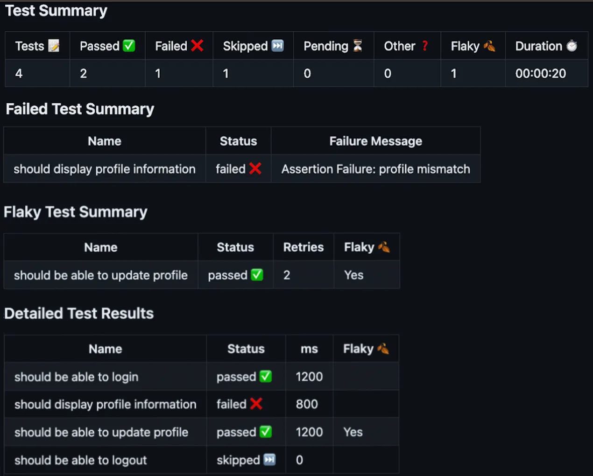
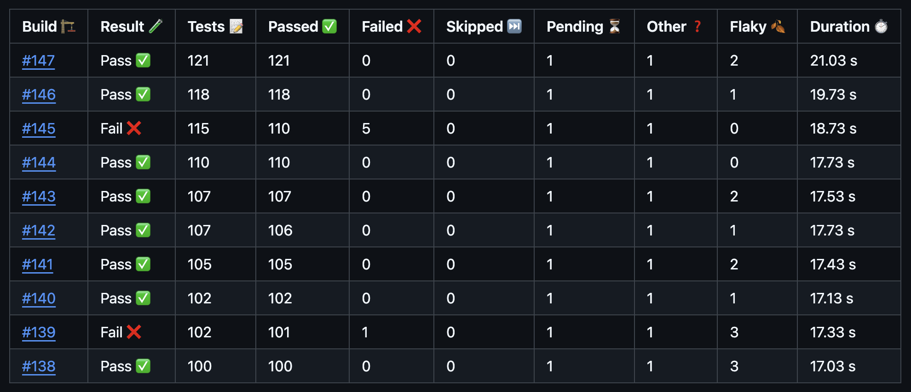
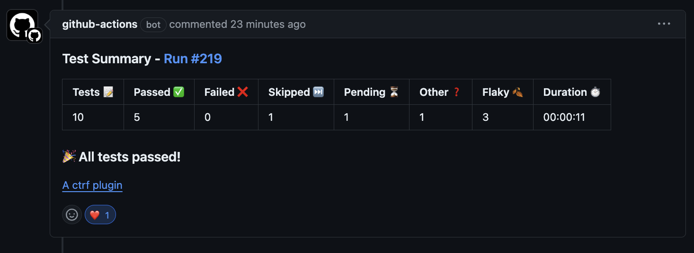
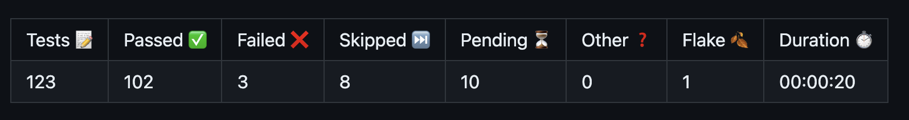
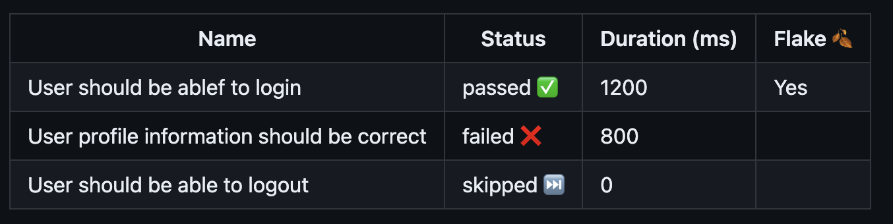
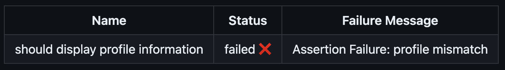
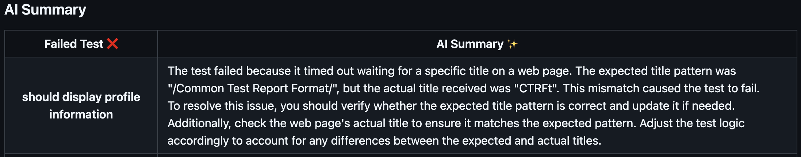
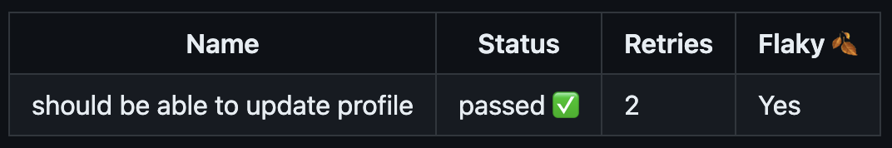

# Publish and View Test Results Reports in Github Actions

> Integrate Test Reporting into Your GitHub Actions Workflow

A GitHub test reporting tool that supports all major testing frameworks. Generate, publish and alert your team with detailed test results, including summaries, in-depth reports, failed test analyses, flaky test detection and AI analyses directly within your GitHub Actions CI/CD workflow and Pull Requests.

Choose from a variety of pre-built views or create custom views tailored to your project's needs, ensuring that test results are always where you need them.

## **⭐⭐ If you find this project useful, consider giving it a GitHub star ⭐⭐**

## You can help us grow

Support our mission to enhance test reporting in Github Actions by:

- **⭐ Starring this repository to show your support. ⭐**
- **🙌 Following our [GitHub page here](https://github.com/ctrf-io) to stay updated. 🙌**

Thank you! Your support is invaluable to us! 💙

## Key Features

- **Seamless Test Result Integration:** View and publish test results directly within the GitHub Actions workflow summary.
- **Automated PR Comments:** Post detailed test results as comments on GitHub Pull Requests automatically, enhancing team collaboration and code review efficiency.
- **Many View Options:** Access a variety of views, including Test Summary, Historical, Detailed Test Results, Failed Tests Overview, and Flaky Tests Analysis.
- **View AI summaries**: View AI generated summaries to help resolve failed tests.
- **Customizable Reports:** Build and customize your own test summary reports to fit specific project requirements.
- **Broad Framework Support:** Compatible with all major testing frameworks through standardized CTRF reports.
- **Easy Setup and Use:** Run the tool with a simple command: npx github-actions-ctrf your-report.json.
- **Merge Multiple Test Reports:** If your framework generates multiple reports, merge them into a single report.

## Example



## Usage


[](https://github.com/ctrf-io/github-actions-ctrf/actions/workflows/main.yaml)


Add to your Github Actions workfile file:

```bash
npx github-actions-ctrf path-to-your-ctrf-report.json
```

Before using the commands, ensure that your GitHub Actions runner has Node.js installed.

Generate a CTRF report using your testing framework. [CTRF reporters](https://github.com/orgs/ctrf-io/repositories) are available for most testing frameworks and easy to install.

**No CTRF reporter? No problem!**

Use [junit-to-ctrf](https://github.com/ctrf-io/junit-to-ctrf) to convert a JUnit report to CTRF

### Full example

```yaml
name: Example workflow file

on: [push]

jobs:
  testing:
    runs-on: ubuntu-latest
    steps:
      - name: Checkout code
        uses: actions/checkout@v4
      - name: Run CTRF annotations
        run: npx github-actions-ctrf path-to-your-ctrf-report.json
        if: always()
```

### Generating All Tables

For a all tables, add the following to your workflow YAML:

```yaml
- name: Publish CTRF Test Summary Results
  run: npx github-actions-ctrf path-to-your-ctrf-report.json
  if: always()
```

### Generating Test Summary Table

For a test summary table, add the `summary` argument to your workflow yaml:

```yaml
- name: Publish CTRF Test Summary Results
  run: npx github-actions-ctrf summary path-to-your-ctrf-report.json
  if: always()
```

### AI Summary

For a AI summary table, add the `ai` argument to your workflow yaml:

```yaml
- name: Publish CTRF AI Test Summary Results
  run: npx github-actions-ctrf ai path-to-your-ctrf-report.json
  if: always()
```

To generate an AI summary checkout the [AI Test Reporter](https://github.com/ctrf-io/ai-test-reporter)

### Generating Detailed Test Table

For a test details table, add the `tests` argument to your workflow yaml:

```yaml
- name: Publish CTRF Detailed Test Summary Results
  run: npx github-actions-ctrf tests path-to-your-ctrf-report.json
  if: always()
```

### Generating Failed Test Details Table

For a failed test details table, add the `failed` argument to your workflow yaml:

```yaml
- name: Publish CTRF Failed Test Summary Results
  run: npx github-actions-ctrf failed path-to-your-ctrf-report.json
  if: always()
```

### Generating Flaky Test Details Table

For a flaky test details table, add the `flaky` argument to your workflow yaml:

```yaml
- name: Publish CTRF Flaky Test Summary Results
  run: npx github-actions-ctrf flaky path-to-your-ctrf-report.json
  if: always()
```

### Generating Fail annotations

For test annotations, add the `annotate` argument to your workflow yaml:

```yaml
- name: Annotate failed tests
  run: npx github-actions-ctrf annotate path-to-your-ctrf-report.json
  if: always()
```

### Historical Test Table

To set up the historical test results table in your GitHub Actions workflow, follow these steps:

#### Generate and Publish Historical Results Table

First, you can generate and publish the historical test results table using the following command:

```yaml
- name: Publish CTRF Historical results table
  run: npx github-actions-ctrf historical path-to-your-ctrf-report.json
  if: always()
  env:
    GITHUB_TOKEN: ${{ secrets.GITHUB_TOKEN }}
```

#### Store CTRF Report as an Artifact

Secondly, you need to upload the CTRF report as an artifact at the end of your test workflow. This ensures that the test results are available for future runs.

```yaml
- name: Upload test results
  uses: actions/upload-artifact@v4
  with:
    name: ctrf-report
    path: path-to-your-ctrf-report.json
```

#### Available Options

The Historical table method comes with several options to customize the output:

- `--rows`: Specifies the number of historical test result rows to show in the table. The default value is 10.
- `--artifact-name`: Sets the name of the artifact where the CTRF report is stored. The default name is ctrf-report.



## Generating an AI summary

You can generate human-readable AI summary for your failed tests using models from the leading AI providers by using the [AI Test Reporter](https://github.com/ctrf-io/ai-test-reporter)

For a AI summary table, add the `ai` argument to your workflow yaml:

```yaml
- name: Publish CTRF AI Test Summary Results
  run: npx github-actions-ctrf ai path-to-your-ctrf-report.json
  if: always()
```

## Posting a Pull Request Comment

You can automatically post a summary of your test results as a comment on your pull request by using the `--pr-comment` argument.

To use this feature, add the `--pr-comment` argument to your command and ensure that the GITHUB_TOKEN is set as an environment variable in your workflow configuration:

```yaml
- name: Post PR Comment
  run: npx github-actions-ctrf ctrf-report.json --pr-comment
  if: always()
  env:
    GITHUB_TOKEN: ${{ secrets.GITHUB_TOKEN }}
```

To post a PR comment only when tests fail, add the `--on-fail-only` argument to your command.

The GITHUB_TOKEN is typically available by default in GitHub Actions, but it needs to have write permissions for pull requests. For guidance on configuring these permissions, please see GitHub's [documentation](https://docs.github.com/en/actions/security-for-github-actions/security-guides/automatic-token-authentication#permissions-for-the-github_token).

### For GitHub Enterprise Server Users

If you are using GitHub Enterprise Server, you need to specify the base URL of your GitHub Enterprise instance. Use the `--domain` argument to provide this URL:

```yaml
- name: Post PR Comment on GitHub Enterprise Server
  run: npx github-actions-ctrf ctrf-report.json --pr-comment --domain https://your-enterprise-domain.com
  if: always()
  env:
    GITHUB_TOKEN: ${{ secrets.GITHUB_TOKEN }}
```

Replace <https://your-enterprise-domain.com> with the base URL of your GitHub Enterprise Server instance. The GITHUB_TOKEN used must have appropriate permissions on the GitHub Enterprise Server instance. For more details, refer to the [GitHub Enterprise Server documentation](https://docs.github.com/en/enterprise-server@3.14/actions/security-for-github-actions/security-guides/automatic-token-authentication#about-the-github_token-secret) on configuring tokens and permissions.



## Custom summary

The custom summary method lets you define how the Github Actions summary or PR comment is presented by using a Handlebars template. The template can include any markdown content and leverage data from your CTRF report and GitHub properties, allowing for dynamic and customizable output.

### How to Use the Custom Summary Command

To use the `custom` summary method, you need to pass two arguments:

- **CTRF Report File:** The path to your CTRF report file, which contains the results of your tests.
- **Handlebars Template File:** The path to a Handlebars file that contains the markdown template.

add the following to your workflow yaml:

```yaml
- name: Publish CTRF Custom summary
  run: npx github-actions-ctrf custom path-to-your-ctrf-report.json path-to-your-handlebars-template.hbs
  if: always()
```

### Writing a Handlebars Markdown Template

Creating a Handlebars markdown template allows you to have full control over how your test results are displayed. With Handlebars and CTRF, you can inject dynamic content into your markdown files, making your summaries flexible and informative.

### Handlebars Basics

Handlebars is a simple templating language that lets you insert data into your markdown in a declarative way. You can use placeholders, conditionals, and loops to dynamically generate content based on your test results.

### Example of a Simple Handlebars Template

Here's a basic example of a Handlebars markdown template that you might use to generate a custom summary:

```hbs
# Custom Test Summary **Total Tests**:
{{ctrf.summary.tests}}
**Passed**:
{{ctrf.summary.passed}}
**Failed**:
{{ctrf.summary.failed}}
**Flaky Tests**:
{{countFlaky ctrf.tests}}
**Duration**:
{{formatDuration ctrf.summary.start ctrf.results.summary.stop}}
```

### Special Handlebars Helpers

When writing your template, you can use several special Handlebars helpers:

- `{{countFlaky ctrf.tests}}`: Counts and returns the number of flaky tests.

- `{{formatDuration ctrf.summary.start ctrf.summary.stop}}`: Formats the duration between start and stop times into a human-readable string.

- `{{stripAnsi message}}`: Strips ANSI from string, useful for when error messages contain ANSI characters.

- `{{eq arg1 arg2}}`: Compares two arguments and returns true if they are equal.

### Available Properties

All CTRF properties are accessible via the ctrf property in your template. Additionally, you can access properties from GitHub using the github property.

The following GitHub properties are available:

- Coming soon!

### Template Example

For inspiration on what you can create, check out the[example template](templates/custom-summary.hbs)

## Options

- `--title`: Title of the summary.
- `--annotate`: annotate failed tests.
- `--domain`: Base URL for GitHub Enterprise Server
- `--pr-comment`: Post a Pull Request comment with the summary
- `--pr-comment-message`: Custom message for your PR comment using a string or handlebars template file ([example](templates/custom.hbs))
- `--on-fail-only`: Post a Pull Request comment only if there are failed tests

## Merge reports

You can merge reports if your chosen reporter generates multiple reports through design, parallelisation or otherwise.

The [ctrf-cli](https://github.com/ctrf-io/ctrf-cli) package provides a method to merge multiple ctrf json files into a single file.

After executing your tests, use the following command:

```sh
npx ctrf merge <directory>
```

Replace directory with the path to the directory containing the CTRF reports you want to merge.

## Components

[Click here](https://github.com/ctrf-io/github-actions-ctrf/actions) to see the Actions of this repository for a full example

### Summary



### Test details



### Failed details



### AI summary



### Flaky details



### Historical


### Pull Request


### Custom Summary

Coming soon!

## What is CTRF?

CTRF is a universal JSON test report schema that addresses the lack of a standardized format for JSON test reports.

**Consistency Across Tools:** Different testing tools and frameworks often produce reports in varied formats. CTRF ensures a uniform structure, making it easier to understand and compare reports, regardless of the testing tool used.

**Language and Framework Agnostic:** It provides a universal reporting schema that works seamlessly with any programming language and testing framework.

**Facilitates Better Analysis:** With a standardized format, programatically analyzing test outcomes across multiple platforms becomes more straightforward.

## Support Us

If you find this project useful, consider giving it a GitHub star ⭐ It means a lot to us.
