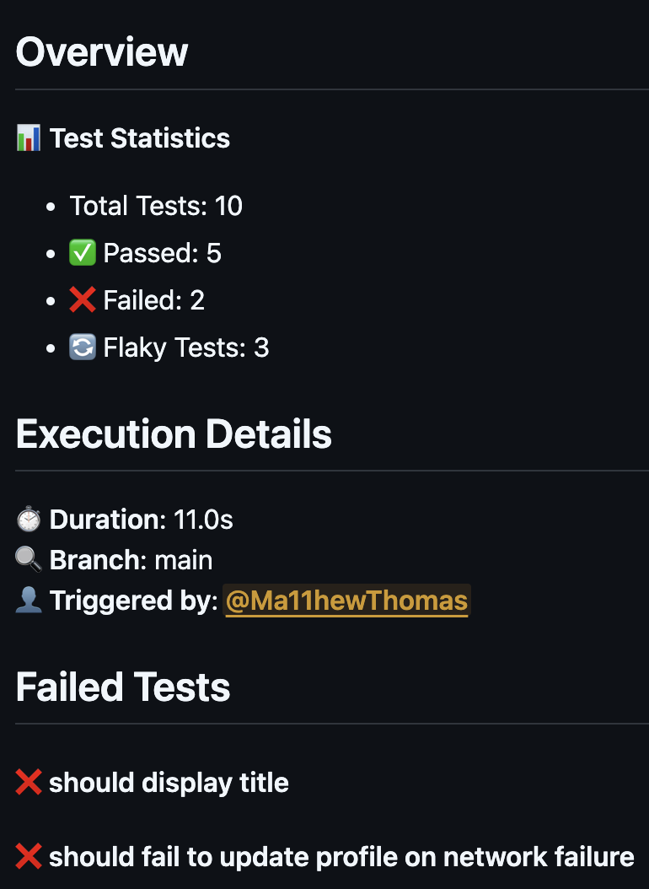

# Build Your Own Report

CTRF allows you to create personalized test result reports in GitHub Actions. This guide will show you how to create your own custom report template using CTRF, Handlebars and GitHub flavored markdown.

## Why Create a Custom Report?

- Full control over the layout and content of your test results
- Ability to highlight information that matters most to your team
- Flexibility to match your organization's reporting standards
- Integration with GitHub-specific data and workflow information
- Share your report with others by submitting it to the [community reports](https://github.com/ctrf-io/github-test-reporter#community-reports) section

Creating a Handlebars markdown template allows you to have full control over how
your test results are displayed. With CTRF, GitHub and Handlebars you can inject
dynamic content into your reports, making your them flexible to suit your needs.

You can apply custom templates when using the `custom-report` method.

## Showcase

All of our reports are built using handlebars, for inspiration check out the
[built-in reports](https://github.com/ctrf-io/github-test-reporter/tree/main/src/reports) and [community reports](https://github.com/ctrf-io/github-test-reporter/tree/main/community-reports).

And for a practical example, see the [custom report example](https://github.com/ctrf-io/github-test-reporter/blob/main/templates/custom-report.hbs).

## Community Reports

The high level of control and flexibility allows for endless customization and a wide range of reports that can be built by the community. That's why we've created a [community reports](https://github.com/ctrf-io/github-test-reporter#community-reports) section where users can share their reports to be used by others.

## Helpful links

- [CTRF schema](https://www.ctrf.io/docs/schema/overview) - for the schema of the data available to use in your template
- [Handlebars documentation](https://handlebarsjs.com/) - for the templating language
- [GitHub Markdown](https://docs.github.com/en/get-started/writing-on-github/getting-started-with-writing-and-formatting-on-github/basic-writing-and-formatting-syntax) - for the markdown syntax
- [GitHub Context](https://docs.github.com/en/actions/writing-workflows/choosing-what-your-workflow-does/accessing-contextual-information-about-workflow-runs) - for the context available to use in your template

## Basic Example

Here's a practical example of a Handlebars template that creates a test summary with explanations:

```hbs
# Test Results Summary

## Overview
{{!-- Display basic test statistics --}}
📊 **Test Statistics**
- Total Tests: {{ctrf.summary.tests}}
- ✅ Passed: {{ctrf.summary.passed}}
- ❌ Failed: {{ctrf.summary.failed}}
- 🔄 Flaky Tests: {{countFlaky ctrf.tests}}

## Execution Details
{{!-- Show timing information --}}
⏱️ **Duration**: {{formatDuration ctrf.summary.start ctrf.summary.stop}}
🔍 **Branch**: {{github.branchName}}
👤 **Triggered by**: {{github.actor}}

{{!-- Conditionally show failures if they exist --}}
{{#if ctrf.summary.failed}}
## Failed Tests
{{#each ctrf.tests}}
{{#if (eq this.status "failed")}}
#### ❌ {{this.name}}
{{/if}}
{{/each}}
{{/if}}
```

This template demonstrates:

- Using basic CTRF properties (`ctrf.summary.*`)
- Accessing GitHub context (`github.*`)
- Using helper functions (`countFlaky`, `formatDuration`, `stripAnsi`)
- Conditional rendering with `{{#if}}` blocks
- Iterating over tests with `{{#each}}`

And what it looks like:



## Handlebars

Handlebars is a simple templating language that lets you insert data into your
markdown in a declarative way. You can use placeholders, conditionals, and loops
to dynamically generate content based on your test results.

## Helpers

When writing your template, you can use several Handlebars helpers:

- `{{countFlaky ctrf.tests}}`: Counts and returns the number of flaky tests.

- `{{formatDuration ctrf.summary.start ctrf.summary.stop}}`: Formats the
  duration between start and stop times into a human-readable string.

- `{{stripAnsi message}}`: Strips ANSI from string, useful for when error
  messages contain ANSI characters.

- `{{eq arg1 arg2}}`: Compares two arguments and returns true if they are equal.

See available helpers [here](https://github.com/ctrf-io/github-test-reporter/tree/main/src/handlebars/helpers).

We welcome contributions for additional helpers.

## CTRF Properties

The `ctrf` object provides access to your test results data. Here are the main properties:

### Summary (`ctrf.summary`)
- `tests`: Total number of tests
- `passed`: Number of passed tests
- `failed`: Number of failed tests
- `skipped`: Number of skipped tests
- `start`: Test suite start time
- `stop`: Test suite end time

### Individual Tests (`ctrf.tests`)
An array of test results, each containing:
- `name`: Test name
- `status`: Test status ("passed", "failed", "skipped")
- `message`: Test output/error message
- `duration`: Test duration in milliseconds
- `retries`: Number of retries (for flaky tests)

Example accessing test data:
```hbs
{{#each ctrf.tests}}
  Test: {{this.name}} - Status: {{this.status}}
{{/each}}
```

## GitHub Properties

GitHub properties are made available to use in your template. You can access
these properties `github` property, for example `github.repoName`

You can access the entire context via the `github.context` property.

[Contexts](https://docs.github.com/en/actions/writing-workflows/choosing-what-your-workflow-does/accessing-contextual-information-about-workflow-runs)
are a way to access information about workflow runs, variables, runner
environments, jobs, and steps. Each context is an object that contains
properties, which can be strings or other objects.

Contexts, objects, and properties will vary significantly under different
workflow run conditions. For example, the matrix context is only populated for
jobs in a matrix.

You can see the content of the context by printing it in the logs:

```yaml
- name: Print GitHub Context
  env:
    CONTEXT: ${{ toJson(github) }}
  run: echo "$CONTEXT" | jq .
```

In addition to context, common properties are made available.

### Root Context

Accessed via root, for example `github.action`

- **`action`**  
  The action name or identifier for the workflow step that is being executed.

- **`action_name`**  
  A mirror of `action`; some systems or templates might rely on a slightly
  different key.

- **`actor`**  
  The GitHub username (or bot name) that triggered the workflow.

- **`actor_name`**  
  A mirror of `actor`; some systems or templates might rely on a slightly
  different key.

- **`eventName`**  
  The event type that triggered the workflow (e.g., `push`, `pull_request`,
  `schedule`).

- **`event_name`**  
  A mirror of `eventName`; some systems or templates might rely on a slightly
  different key.

- **`sha`**  
  The commit SHA that triggered the workflow.

- **`ref`**  
  The Git reference for the workflow run (e.g., `refs/heads/main`).

- **`workflow`**  
  The name of the workflow file (as defined in `.github/workflows/...`).

- **`job`**  
  The name of the current job being executed within the workflow.

- **`job_id`**  
  A mirror of `job`; some systems or templates might rely on a slightly
  different key.

- **`runNumber`**  
  The sequential number of the workflow run (increments every run).

- **`run_number`**  
  A mirror of `runNumber`; some systems or templates might rely on a slightly
  different key.

- **`runId`**  
  A unique numeric ID for the entire workflow run.

- **`run_id`**  
  A mirror of `runId`; some systems or templates might rely on a slightly
  different key.

- **`apiUrl`**  
  The base URL for accessing the GitHub REST API (e.g.,
  `https://api.github.com`).

- **`api_url`**  
  A mirror of `apiUrl`; some systems or templates might rely on a slightly
  different key.

- **`serverUrl`**  
  The main server URL for GitHub (e.g., `https://github.com`).

- **`server_url`**  
  A mirror of `serverUrl`; some systems or templates might rely on a slightly
  different key.

- **`graphqlUrl`**  
  The base URL for accessing the GitHub GraphQL API.

- **`graphql_url`**  
  A mirror of `graphqlUrl`; some systems or templates might rely on a slightly
  different key.

- **`repoName`**  
  The name of the repository (extracted from
  `context.payload.repository?.name`).

- **`build_url`**  
  A direct link to the summary page of the workflow run, constructed from the
  server URL, repository owner/repo, and the `runId`.

- **`jobName`**  
  (CLI-specific) A mirror of `job`; some legacy templates might rely on this
  property.

- **`workflowId`**  
  (CLI-specific) A mirror of `runId`; some legacy templates might rely on this
  property.

- **`workflowName`**  
  (CLI-specific) A mirror of `workflow`; some legacy templates might rely on
  this property.

- **`actorName`**  
  (CLI-specific) A mirror of `actor`; some legacy templates might rely on this
  property.

- **`pullRequestNumber`**  
  The pull request number if the event is a pull request; otherwise `null`.

- **`baseURL`**  
  A mirror of `serverUrl`; may be used for constructing additional links.

---

### Additional Context

Accessed via additional, for example `github.additional.buildUrl`

- **`buildUrl`**  
  A user-friendly URL to the workflow run summary page.  
  _Same as `build_url` below._

- **`build_url`**  
  A mirror of `buildUrl`; some templates or systems may expect an underscore
  version.

- **`branchName`**  
  The name of the branch being worked on (taken from
  `process.env.GITHUB_REF_NAME` if available).

---

### Repository Context

All of these properties come from the `context.payload.repository` object. If
the repository data does not exist in the payload, these properties default to
empty strings or fallback values.

Accessed via repository, for example `github.repository.cloneUrl`

- **`cloneUrl` / `clone_url`**  
  The URL to clone the repository via HTTPS.

- **`createdAt` / `created_at`**  
  The date-time string representing when the repository was created.

- **`defaultBranch` / `default_branch`**  
  The default branch for the repository (e.g., `main`).

- **`description`**  
  The repository's description (or `null` if not set).

- **`fullName` / `full_name`**  
  The full slug of the repository (`owner/repo`).

- **`htmlUrl` / `html_url`**  
  The public-facing URL of the repository (e.g.,
  `https://github.com/owner/repo`).

- **`language`**  
  The primary coding language of the repository (or `null` if none).

- **`licenseName` / `license_name`**  
  The name of the license if provided (e.g., `MIT`), or `null`.

- **`name`**  
  The short name of the repository (without the owner).

- **`openIssuesCount` / `open_issues_count`**  
  The number of open issues in the repository.

- **`size`**  
  The size of the repository (in kilobytes).

- **`stargazersCount` / `stargazers_count`**  
  The number of stars the repository has.

- **`allowForking` / `allow_forking`**  
  Indicates whether the repository allows forking.

- **`compareUrl` / `compare_url`**  
  A URL to compare branches/commits in the repository (converted to an HTML URL
  if possible).

- **`contributorsUrl` / `contributors_url`**  
  A URL to the contributors page of the repository (converted to HTML form).

- **`deploymentsUrl` / `deployments_url`**  
  A URL to the deployments page of the repository (converted to HTML form).

- **`downloadsUrl` / `downloads_url`**  
  A URL to the downloads page of the repository (converted to HTML form).

- **`eventsUrl` / `events_url`**  
  A URL to the events page of the repository (converted to HTML form).

- **`forksUrl` / `forks_url`**  
  A URL to the forks page of the repository (converted to HTML form).

- **`sshUrl` / `ssh_url`**  
  The URL to clone the repository via SSH.

- **`stargazersUrl` / `stargazers_url`**  
  A URL to the stargazers page of the repository (converted to HTML form).

- **`statusesUrl` / `statuses_url`**  
  A URL to the statuses page of the repository (converted to HTML form, using
  the current `sha`).

- **`subscriptionUrl` / `subscription_url`**  
  A URL to the subscription page of the repository (converted to HTML form).

- **`tagsUrl` / `tags_url`**  
  A URL to the repository tags (converted to HTML form).

- **`teamsUrl` / `teams_url`**  
  A URL to the teams page of the repository (converted to HTML form).

---

### Pull Request Context

All of these properties come from the `context.payload.pull_request` object. If
there is no pull request (e.g., on a `push` event), these properties default to
empty strings or fallback values.

Access via pull_request, for example `github.pull_request.additions`

- **`additions`**  
  Number of additions in the pull request.

- **`assignee`**  
  The single assignee if one is designated (or `null`).

- **`assignees`**  
  The array of all assignees.

- **`authorAssociation` / `author_association`**  
  The author's relationship to the repository (e.g., `OWNER`, `CONTRIBUTOR`).

- **`autoMerge` / `auto_merge`**  
  Auto-merge configuration if enabled (or `null`).

- **`pushedAt` / `pushed_at`**  
  Date-time string of the last time the head commit was pushed.

- **`body`**  
  The main text body of the pull request (or `null`).

- **`changedFiles` / `changed_files`**  
  Number of changed files in the pull request.

- **`closedAt` / `closed_at`**  
  Date-time string of when the PR was closed (or `null`).

- **`comments`**  
  Number of comments on the pull request.

- **`createdAt` / `created_at`**  
  Date-time string of when the PR was opened.

- **`deletions`**  
  Number of deletions in the pull request.

- **`diffUrl` / `diff_url`**  
  A URL to view the diff of the pull request.

- **`draft`**  
  Indicates whether the pull request is in draft mode.

- **`htmlUrl` / `html_url`**  
  The public-facing URL of the pull request.

- **`id`**  
  The unique numeric ID of the pull request on GitHub.

- **`labels`**  
  An array of label objects associated with the pull request.

- **`number`**  
  The pull request number.

- **`patchUrl` / `patch_url`**  
  A URL to download the patch for the pull request.

- **`rebaseable`**  
  Indicates whether the pull request can be rebased.

- **`requestedReviewers` / `requested_reviewers`**  
  An array of users requested for review.

- **`requestedTeams` / `requested_teams`**  
  An array of teams requested for review.

- **`reviewComments` / `review_comments`**  
  Number of review comments on the pull request.

- **`state`**  
  The state of the pull request (e.g., `open`, `closed`).

- **`title`**  
  The pull request title.

---

### Sender Context

All of these properties come from the `context.payload.sender` object. If there
is no sender, these properties fall back to empty strings or `false`.

Accessed via sender, for example `github.sender.login`

- **`login`**  
  The username of the person or bot that initiated the event.

- **`id`**  
  The numeric ID of the sender.

- **`nodeId` / `node_id`**  
  A global node ID (GitHub’s internal GraphQL ID).

- **`avatarUrl` / `avatar_url`**  
  A URL to the sender’s avatar image.

- **`gravatarId` / `gravatar_id`**  
  (Legacy) A Gravatar ID for the user (often an empty string).

- **`htmlUrl` / `html_url`**  
  The public profile page of the sender.

- **`type`**  
  The type of user (e.g., `User`, `Bot`, or `Organization`).

- **`siteAdmin` / `site_admin`**  
  Indicates whether this user is a GitHub site administrator.
