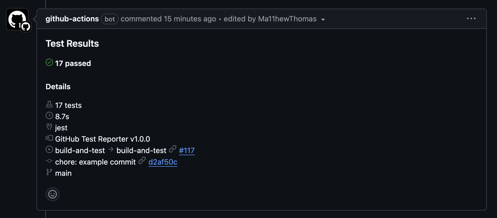

# Report Showcase

A showcase of built-in reports designed to provide detailed insights into test
execution.

## Table of Contents

- [Report Showcase](#report-showcase)
  - [Summary Report](#summary-report)
  - [GitHub Report](#github-report)
  - [Test Report](#test-report)
  - [Test List Report](#test-list-report)
  - [Failed Report](#failed-report)
  - [Fail Rate Report](#fail-rate-report)
  - [Flaky Report](#flaky-report)
  - [Flaky Rate Report](#flaky-rate-report)
  - [Failed Folded Report](#failed-folded-report)
  - [Previous Results Report](#previous-results-report)
  - [Insights Report](#insights-report)
  - [Slowest Report](#slowest-report)
  - [AI Report](#ai-report)
  - [Skipped Report](#skipped-report)
  - [Suite Folded Report](#suite-folded-report)
  - [Suite List Report](#suite-list-report)
  - [Commit Report](#commit-report)
  - [Pull Request Report](#pull-request-report)

## Summary Report

### Overview

Provides a quick summary of the test results, displayed in a concise table
format. Use it to get an overview of test statuses, including passed, failed,
skipped, pending, flaky and other categories.

### Usage

Set the `summary-report` input to true in your workflow configuration:

```yaml
- name: Publish Test Report
  uses: ctrf-io/github-test-reporter@v1
  with:
    report-path: './ctrf/*.json'
    summary-report: true
  if: always()
```

---

| **Tests 📝** | **Passed ✅** | **Failed ❌** | **Skipped ⏭️** | **Pending ⏳** | **Other ❓** | **Flaky 🍂** | **Duration ⏱️** |
| ------------ | ------------- | ------------- | -------------- | -------------- | ------------ | ------------ | --------------- |
| 10           | 5             | 3             | 1              | 1              | 1            | 3            | 11.0s           |

## GitHub Report

### Overview

Provides a test report that meets the [GitHub Design System](https://primer.style/guides/introduction). Specifically, it uses the GitHub icons and color scheme to acheive a native GitHub look and feel.

The report includes a summary of the test results and an expandable section for failed, flaky, skipped, and pending tests.

it also includes context like git and action information.

### Usage

Set the `github-report` input to true in your workflow configuration:

```yaml
- name: Publish Test Report
  uses: ctrf-io/github-test-reporter@v1
  with:
    report-path: './ctrf/*.json'
    github-report: true
  if: always()
```

---




### Overview

Provides a detailed test report of all executed test cases, including their
status, whether they are marked as flaky, and their execution duration. Use this
table to identify test cases that passed, failed, are skipped, pending, or
marked with other statuses. It also highlights tests that require attention due
to potential flakiness.

### Usage

Set the `test-report` input to true in your workflow configuration:

```yaml
- name: Publish Test Report
  uses: ctrf-io/github-test-reporter@v1
  with:
    report-path: './ctrf/*.json'
    test-report: true
  if: always()
```

---

| **Test Name**                                    | **Status** | **Flaky** | **Duration** |
| ------------------------------------------------ | ---------- | --------- | ------------ |
| should be able to login                          | ✅         |           | 1.2s         |
| should display title                             | ❌         |           | 800ms        |
| should be able to update profile                 | ✅         | 🍂        | 1.2s         |
| should be able to logout                         | ⏭️         |           | 1ms          |
| should validate user settings                    | ✅         |           | 1.1s         |
| should fail to update profile on network failure | ❌         |           | 900ms        |
| should fail to update profile on network failure | ❌         |           | 900ms        |
| should load user data                            | ⏳         |           | 1ms          |
| should handle session timeouts                   | ✅         | 🍂        | 950ms        |
| should clean up user session on logout           | ❓         |           | 1.1s         |
| should allow user to change password             | ✅         | 🍂        | 1.3s         |

## Test List Report

### Overview

Provides a detailed, line-by-line breakdown of all executed test cases, their
statuses, and associated error messages or additional context for failures. This
report is particularly useful for quickly identifying failed tests,
understanding why they failed, and tracking the overall progress of test
execution. Each test case includes its status (e.g., passed, failed, skipped,
etc.) along with any relevant failure details

### Usage

Set the `test-list-report` input to true in your workflow configuration:

```yaml
- name: Publish Test Report
  uses: ctrf-io/github-test-reporter@v1
  with:
    report-path: './ctrf/*.json'
    test-list-report: true
  if: always()
```

---

- **✅ should be able to login**
- **❌ should display title**
  - Timed out 5000ms waiting for `expect(locator).toHaveTitle(expected)`
  - Locator: `locator(':root')`
  - Expected pattern: `/Playwrc cight/`
  - Received string:
    `"Fast and reliable end-to-end testing for modern web apps | Playwright"`
  - Call log:
    - `expect.toHaveTitle` with timeout 5000ms
    - Waiting for `locator(':root')`
    - Locator resolved to
      `<html lang="en" dir="ltr" data-theme="light" data-has-…>…</html>`
    - Unexpected value:
      `"Fast and reliable end-to-end testing for modern web apps | Playwright"`
- **✅ should be able to update profile**
- **⏭️ should be able to logout**
- **✅ should validate user settings**
- **❌ should fail to update profile on network failure**
  - Network Timeout
- **❌ should fail to update profile on network failure**
  - No failure message
- **⏳ should load user data**
- **✅ should handle session timeouts**
- **❓ should clean up user session on logout**
- **✅ should allow user to change password**

## Failed Report

### Overview

Focuses exclusively on failed test cases, providing a clear and concise summary
of each failure. For every failed test, the report includes the test name, the
failure message. This report is designed to help developers quickly diagnose and
address issues.

### Usage

Set the `failed-report` input to true in your workflow configuration:

```yaml
- name: Publish Test Report
  uses: ctrf-io/github-test-reporter@v1
  with:
    report-path: './ctrf/*.json'
    failed-report: true
  if: always()
```

---

<table>
    <thead>
      <tr>
        <th>Failed Tests ❌</th>
        <th>Fail Message</th>
      </tr>
    </thead>
    <tbody>
        <tr>
          <td>❌ should display title</td>
          <td>Timed out 5000ms waiting for expect(locator).toHaveTitle(expected)<br><br>Locator: locator(':root')<br>Expected pattern: /Playwrc cight/<br>Received string:  "Fast and reliable end-to-end testing for modern web apps | Playwright"<br>Call log:<br>  - expect.toHaveTitle with timeout 5000ms<br>  - waiting for locator(':root')<br>  -   locator resolved to <html lang="en" dir="ltr" data-theme="light" data-has-…>…</html><br>  -   unexpected value "Fast and reliable end-to-end testing for modern web apps | Playwright"<br></td>
        </tr>
        <tr>
          <td>❌ should fail to update profile on network failure</td>
          <td>Network Timeout</td>
        </tr>
        <tr>
          <td>❌ should fail to update profile on network failure</td>
          <td>No failure message</td>
        </tr>
    </tbody>
  </table>

## Fail Rate Report

### Overview

Provides a detailed analysis of the fail rates for tests that are currently live
and were executed in the latest run. By incorporating both the current run and
historical data, it provides a comprehensive view of test stability over time.
This report highlights the fail rate for each individual test as well as the
overall fail rate for the entire test execution, helping teams evaluate the
reliability of their test suite and focus on areas that require attention.

The fail rate reflects how often tests fail based on their final outcomes,
excluding any retries. This metric identifies tests with consistent failures,
enabling teams to prioritize fixes and improve overall test reliability.

Use the `previous-results-max` input to state how many previous results to
include in the calculation. The default is 10.

This report goes nicely with the insights-report, flaky-rate-report, and
slowest-report to provide a comprehensive view of the performance of your tests
over time.

Test case fail rate is calculated by dividing the fail count by the total runs
and multiplying by 100:

Fail Rate (%) = (Fail Count ÷ Total Runs) × 100

Overall fail rate across all tests is calculated by summing the fail counts and
total runs of all tests:

Overall Fail Rate (%) = (Total Fail Counts of All Tests ÷ Total Runs of All
Tests) × 100

### Usage

Set the `fail-rate-report` input to true in your workflow configuration:

```yaml
- name: Publish Test Report
  uses: ctrf-io/github-test-reporter@v1
  with:
    report-path: './ctrf/*.json'
    fail-rate-report: true
    previous-results-max: 100
  if: always()
```

---

#### Overall Fail Rate: 13.56%

| Test 📝                                          | Runs 🎯 | Pass ✅ | Fail ❌ | Fail Rate % |
| ------------------------------------------------ | ------- | ------- | ------- | ----------- |
| should fail to update profile on network failure | 12      | 8       | 4       | 33.33       |
| should load user data                            | 9       | 6       | 3       | 33.33       |
| should clean up user session on logout           | 6       | 4       | 2       | 33.33       |
| should display title                             | 10      | 7       | 3       | 30          |
| should be able to logout                         | 8       | 6       | 2       | 25          |

<sub><i>Measured over 6 runs.</i></sub>

## Flaky Report

### Overview

Highlights flaky tests from the current run and lists the number of retries each
test required to achieve a stable outcome. By focusing on these tests, teams can
address potential issues in test reliability.

### Usage

Set the `flaky-rate-report` input to true in your workflow configuration:

```yaml
- name: Publish Test Report
  uses: ctrf-io/github-test-reporter@v1
  with:
    report-path: './ctrf/*.json'
    flaky-rate-report: true
  if: always()
```

---

| **Flaky Tests 🍂**                      | **Retries** |
| --------------------------------------- | ----------- |
| 🍂 should be able to update profile     | 2           |
| 🍂 should handle session timeouts       | 1           |
| 🍂 should allow user to change password | 3           |

## Flaky Rate Report

### Overview

Offers a detailed analysis of flaky rates for tests that are currently live and
were executed in the latest run. By considering both the current run and
historical data, it provides a comprehensive view of test stability over time.
The report calculates flaky rates by factoring in both pass and fail outcomes
across all attempts. It highlights the flaky rate for each test and includes an
overall flaky rate for the entire test execution, helping teams identify and
address unreliable tests effectively.

The flaky rate reflects how often tests exhibit flaky behavior—tests that fail
initially but pass upon retry. Using test retries is essential for detecting
flaky tests within CTRF.

Use the `previous-results-max` input to state how many previous results to
include in the calculation. The default is 10.

This report goes fits nicely with the insights-report, fail-rate-report, and
slowest-report to provide a comprehensive view of the performance of your tests
over time.

Test flaky rate (%) is calculated by dividing the number of flaky occurrences by
the total number of test attempts (including retries) and multiplying by 100:

Flaky Rate (%) = (Flaky Occurrences ÷ Total Attempts) × 100

Overall flaky rate across all tests is calculated by summing the flaky
occurrences and total attempts of all tests:

Overall Flaky Rate (%) = (Total Flaky Occurrences of All Tests ÷ Total Attempts
of All Tests) × 100

### Usage

Set the `flaky-rate-report` input to true in your workflow configuration:

```yaml
- name: Publish Test Report
  uses: ctrf-io/github-test-reporter@v1
  with:
    report-path: './ctrf/*.json'
    flaky-rate-report: true
    previous-results-max: 100
  if: always()
```

---

#### Overall Flaky Rate: 35.29%

| Test 📝                              | Attempts 🎯 | Pass ✅ | Fail ❌ | Flaky Rate % 🍂 |
| ------------------------------------ | ----------- | ------- | ------- | --------------- |
| should allow user to change password | 28          | 7       | 21      | 75.00           |
| should be able to update profile     | 21          | 7       | 14      | 66.67           |
| should handle session timeouts       | 14          | 7       | 7       | 50.00           |

<sub><i>Measured over 7 runs.</i></sub>

## Failed Folded Report

### Overview

Provides a compact and interactive view of failed tests by using collapsible
sections for each failure. Each section includes the test name, failure details,
and trace information to help developers quickly identify and address issues.
This format is particularly useful for organizing extensive failure logs, as it
minimizes visual clutter while still offering access to all the necessary
information. By expanding the collapsible sections, developers can drill down
into specific failure details and traces to diagnose problems efficiently.

### Usage

Set the `failed-folded-report` input to true in your workflow configuration:

```yaml
- name: Publish Test Report
  uses: ctrf-io/github-test-reporter@v1
  with:
    report-path: './ctrf/*.json'
    failed-folded-report: true
  if: always()
```

---

 <table>
  <thead>
    <tr>
      <th>Failed Tests</th>
    </tr>
  </thead>
  <tbody>
      <tr>
        <td>
          <details>
            <summary>❌ should display title</summary>
            <pre><code>Timed out 5000ms waiting for expect(locator).toHaveTitle(expected)
Locator: locator(&#x27;:root&#x27;)
Expected pattern: /Playwrc cight/
Received string:  &quot;Fast and reliable end-to-end testing for modern web apps | Playwright&quot;
Call log:
  - expect.toHaveTitle with timeout 5000ms
  - waiting for locator(&#x27;:root&#x27;)
  -   locator resolved to &lt;html lang&#x3D;&quot;en&quot; dir&#x3D;&quot;ltr&quot; data-theme&#x3D;&quot;light&quot; data-has-…&gt;…&lt;/html&gt;
  -   unexpected value &quot;Fast and reliable end-to-end testing for modern web apps | Playwright&quot;
</code></pre>
            <p><strong>Trace:</strong></p>
            <pre><code>ProfileTest.js:45</code></pre>
          </details>
        </td>
      </tr>
      <tr>
        <td>
          <details>
            <summary>❌ should fail to update profile on network failure</summary>
            <pre><code>Network Timeout</code></pre>
            <p><strong>Trace:</strong></p>
            <pre><code>ProfileUpdateTest.js:60</code></pre>
          </details>
        </td>
      </tr>
      <tr>
        <td>
          <details>
            <summary>❌ should fail to update profile on network failure</summary>
            <pre><code>No message available</code></pre>
            <p><strong>Trace:</strong></p>
            <pre><code>No trace available</code></pre>
          </details>
        </td>
      </tr>
  </tbody>
</table>

## Previous Results Report

### Overview

Provides a historical view of test execution results across recent builds. This
report includes key metrics such as the total number of tests, their statuses
(passed, failed, skipped, pending, and other), flaky test counts, and overall
duration for each build. By linking directly to build summaries, it allows
developers to track trends in test outcomes over time and identify patterns or
recurring issues. This insight helps teams monitor the stability of their test
suite and prioritize areas for improvement based on historical performance.

Use the `previous-results-max` input to state how many previous results to
include in the calculation. The default is 10.

### Usage

Set the `previous-results-report` input to true in your workflow configuration:

```yaml
- name: Publish Test Report
  uses: ctrf-io/github-test-reporter@v1
  with:
    report-path: './ctrf/*.json'
    previous-results-report: true
  if: always()
```

---

| **Build 🏗️**                                                                                      | **Result 🧪** | **Tests 📝** | **Passed ✅** | **Failed ❌** | **Skipped ⏭️** | **Pending ⏳** | **Other ❓** | **Flaky 🍂** | **Duration ⏱️** |
| ------------------------------------------------------------------------------------------------- | ------------- | ------------ | ------------- | ------------- | -------------- | -------------- | ------------ | ------------ | --------------- |
| [#7](https://github.com/Ma11hewThomas/github-test-reporter-test/actions/runs/12818357737#summary) | ❌            | 10           | 5             | 3             | 1              | 1              | 1            | 3            | 11.0s           |
| [#6](https://github.com/Ma11hewThomas/github-test-reporter-test/actions/runs/12818178851)         | ❌            | 10           | 5             | 3             | 1              | 1              | 1            | 3            | 11.0s           |
| [#5](https://github.com/Ma11hewThomas/github-test-reporter-test/actions/runs/12818142979)         | ❌            | 10           | 5             | 3             | 1              | 1              | 1            | 3            | 11.0s           |
| [#4](https://github.com/Ma11hewThomas/github-test-reporter-test/actions/runs/12818015408)         | ❌            | 10           | 5             | 3             | 1              | 1              | 1            | 3            | 11.0s           |
| [#3](https://github.com/Ma11hewThomas/github-test-reporter-test/actions/runs/12817883348)         | ❌            | 10           | 5             | 3             | 1              | 1              | 1            | 3            | 11.0s           |
| [#2](https://github.com/Ma11hewThomas/github-test-reporter-test/actions/runs/12817830233)         | ❌            | 10           | 5             | 3             | 1              | 1              | 1            | 3            | 11.0s           |
| [#1](https://github.com/Ma11hewThomas/github-test-reporter-test/actions/runs/12817798111)         | ❌            | 10           | 5             | 3             | 1              | 1              | 1            | 3            | 11.0s           |

## Insights Report

### Overview

Provides insights about the latest builds. This report includes key metrics
includes key metrics average tests per run, total flaky tests, total failed, and
slowest test (p95). It helps teams to optimise their test suite and improve the
overall test reliability. 

Use the `previous-results-max` input to state how many previous results to
include in the calculation. The default is 10.

This report goes fits nicely with the flaky-rate-report,
fail-rate-report, and slowest-report to provide a comprehensive view of the performance of your test suite overtime.

### Usage

Set the `insights-report` input to true in your workflow configuration:

```yaml
- name: Publish Test Report
  uses: ctrf-io/github-test-reporter@v1
  with:
    report-path: './ctrf/*.json'
    insights-report: true
  if: always()
```

---

| Average Tests per Run | Total Flaky Tests | Total Failed | Slowest Test (p95) |
|----------------------|-------------------|----------------|-------------------|
| 17 | 0 | 0 | 12ms |

<sub><i>Measured over 2 runs.</i></sub>

## Slowest Report

### Overview

Provides a detailed view of the slowest tests from the current and previous results. This report
includes the test name, number of runs, number of failures, failure rate, and
average duration. It helps teams identify and address performance issues in their
test suite.

Use the `previous-results-max` input to state how many previous results to
include in the calculation. The default is 10.

This report fits nicely with the insights-report, fail-rate-report, and
flaky-rate-report to provide a comprehensive view of the performance of your tests
over time.

### Usage

Set the `slowest-report` input to true in your workflow configuration:

```yaml
- name: Publish Test Report
  uses: ctrf-io/github-test-reporter@v1
  with:
    report-path: './ctrf/*.json'
    slowest-report: true
  if: always()
```

---

### Slowest Tests

| Test 📝 | Runs 🎯 | Fail ❌ | Fail Rate % | Average Duration (p95) ⏱️ |
|-----------|-----------------|------------|----------|-----------|
| helpers.test.ts &gt; stripAnsi - stripAnsi throws a TypeError if the input is not a string | 1 | 0 | 0% | 12ms |
| handler.test.ts &gt; createStatusCheck - createStatusCheck should create a successful check run when no tests failed | 1 | 0 | 0% | 5ms |
| helpers.test.ts &gt; getEmoji - getEmoji returns the correct emoji for &quot;passed&quot; | 1 | 0 | 0% | 4ms |
| helpers.test.ts &gt; getEmoji - getEmoji returns the correct emoji for &quot;duration&quot; | 1 | 0 | 0% | 1ms |
| helpers.test.ts &gt; getEmoji - getEmoji returns the correct emoji for &quot;tests&quot; | 1 | 0 | 0% | 1ms |
| helpers.test.ts &gt; stripAnsi - stripAnsi removes ANSI escape codes from a string | 1 | 0 | 0% | 1ms |
| handler.test.ts &gt; createStatusCheck - createStatusCheck should truncate summary if it exceeds 65000 characters | 1 | 0 | 0% | 1ms |

<sub><i>Measured over 2 runs.</i></sub>

## AI Report

Leverages AI-generated insights to provide detailed summaries for failed tests.
For each failure, the report includes an AI-powered explanation of potential
causes and suggested solutions to help developers quickly identify and resolve
issues. If no AI summary is available for a particular test, the report
indicates this clearly. This report is especially useful for streamlining
debugging processes and enhancing test reliability by offering actionable
insights directly within the test report.

### Usage

Set the `ai-report` input to true in your workflow configuration:

```yaml
- name: Publish Test Report
  uses: ctrf-io/github-test-reporter@v1
  with:
    report-path: './ctrf/*.json'
    ai-report: true
  if: always()
```

---

<table>
    <thead>
        <tr>
            <th>Failed Tests</th>
            <th>AI Summary ✨</th>
        </tr>
    </thead>
    <tbody>
<tr>
            <td>❌ should display title</td>
            <td>The test failed because the page title didn't match the expected value within the given timeout period.<br><br>To resolve this issue, you should first check if the title of the page is correct in your application. It seems there might be a typo or a misunderstanding about what the actual title should be. If 'Common Test Report Format' is indeed the correct title, you'll need to update your test expectations. On the other hand, if 'Uncommon Test Report Format' is the intended title, you'll need to fix the title in your application code.<br><br>Another possibility is that the page might be taking longer to load than expected, causing the title to not appear within the 5-second timeout. In this case, you could try increasing the timeout duration in your test to give the page more time to load completely.</td>
        </tr><tr>
            <td>❌ should fail to update profile on network failure</td>
            <td>No AI summary available</td>
        </tr><tr>
            <td>❌ should fail to update profile on network failure</td>
            <td>No AI summary available</td>
        </tr>    </tbody>
</table>

## Skipped Report

### Overview

Provides a summary of tests that were not executed during the current test run.
It includes tests marked as skipped, pending, or categorized as other. This
report helps teams identify tests that are not actively contributing to the test
suite results, allowing for a review of their relevance, implementation status,
or any issues preventing their execution.

### Usage

Set the `skipped-report` input to true in your workflow configuration:

```yaml
- name: Publish Test Report
  uses: ctrf-io/github-test-reporter@v1
  with:
    report-path: './ctrf/*.json'
    skipped-report: true
  if: always()
```

---

| **Tests**                              | **Status** |
| -------------------------------------- | ---------- |
| should be able to logout               | skipped ⏭️ |
| should load user data                  | pending ⏳ |
| should clean up user session on logout | other ❓   |

## Suite Folded Report

### Overview

Organizes test results by suite, providing a structured and interactive view of
test execution. Each suite is displayed in a collapsible section that summarizes
the number of tests that passed, failed, or were marked as other statuses such
as skipped or pending. This format allows developers to quickly navigate large
test suites, focusing on specific areas of interest. Detailed results for each
test are available within the collapsible sections, including execution times
and statuses.

This report is particularly useful for identifying problematic suites,
understanding test distribution, and prioritizing fixes to improve the
reliability of specific areas in the codebase. The concise summary at the top
provides a quick snapshot of the overall test outcomes.

### Usage

Set the `suite-folded-report` input to true in your workflow configuration:

```yaml
- name: Publish Test Report
  uses: ctrf-io/github-test-reporter@v1
  with:
    report-path: './ctrf/*.json'
    suite-folded-report: true
  if: always()
```

---

<p><strong>5 passed</strong>, <strong>3 failed</strong>, and <strong>3 other</strong></p>
<table>
  <thead>
    <tr>
      <th>Suite</th>
      <th>Passed</th>
      <th>Failed</th>
      <th>Other</th>
      <th>Duration</th>
    </tr>
  </thead>
  <tbody>
    <tr>
      <td>
        <details>
          <summary>✅ login.test.ts &gt; login</summary>
          <div>&nbsp;&nbsp;&nbsp;&nbsp;&nbsp;&nbsp;&nbsp;&nbsp;✅ should be able to login</div>
          <div>&nbsp;&nbsp;&nbsp;&nbsp;&nbsp;&nbsp;&nbsp;&nbsp;⏭️ should be able to logout</div>
        </details>
      </td>
      <td>✅ 1</td>
      <td>❌ 0</td>
      <td>⏭️ 1</td>
      <td>1.2s</td>
    </tr>
    <tr>
      <td>
        <details>
          <summary>❌ login.test.ts &gt; profile</summary>
          <div>&nbsp;&nbsp;&nbsp;&nbsp;&nbsp;&nbsp;&nbsp;&nbsp;❌ should display title</div>
          <div>&nbsp;&nbsp;&nbsp;&nbsp;&nbsp;&nbsp;&nbsp;&nbsp;✅ should be able to update profile</div>
        </details>
      </td>
      <td>✅ 1</td>
      <td>❌ 1</td>
      <td>⏭️ 0</td>
      <td>2.0s</td>
    </tr>
    <tr>
      <td>
        <details>
          <summary>✅ settings.test.ts &gt; settings</summary>
          <div>&nbsp;&nbsp;&nbsp;&nbsp;&nbsp;&nbsp;&nbsp;&nbsp;✅ should validate user settings</div>
        </details>
      </td>
      <td>✅ 1</td>
      <td>❌ 0</td>
      <td>⏭️ 0</td>
      <td>1.1s</td>
    </tr>
    <tr>
      <td>
        <details>
          <summary>❌ network.test.ts &gt; network</summary>
          <div>&nbsp;&nbsp;&nbsp;&nbsp;&nbsp;&nbsp;&nbsp;&nbsp;❌ should fail to update profile on network failure</div>
          <div>&nbsp;&nbsp;&nbsp;&nbsp;&nbsp;&nbsp;&nbsp;&nbsp;❌ should fail to update profile on network failure</div>
          <div>&nbsp;&nbsp;&nbsp;&nbsp;&nbsp;&nbsp;&nbsp;&nbsp;✅ should handle session timeouts</div>
          <div>&nbsp;&nbsp;&nbsp;&nbsp;&nbsp;&nbsp;&nbsp;&nbsp;❓ should clean up user session on logout</div>
          <div>&nbsp;&nbsp;&nbsp;&nbsp;&nbsp;&nbsp;&nbsp;&nbsp;✅ should allow user to change password</div>
        </details>
      </td>
      <td>✅ 2</td>
      <td>❌ 2</td>
      <td>⏭️ 1</td>
      <td>5.1s</td>
    </tr>
    <tr>
      <td>
        <details>
          <summary>✅ ungrouped</summary>
          <div>&nbsp;&nbsp;&nbsp;&nbsp;&nbsp;&nbsp;&nbsp;&nbsp;⏳ should load user data</div>
        </details>
      </td>
      <td>✅ 0</td>
      <td>❌ 0</td>
      <td>⏭️ 1</td>
      <td>1ms</td>
    </tr>
  </tbody>
</table>

## Suite List Report

### Overview

Provides a detailed, flat list of all executed tests grouped by their respective
suites. Each suite displays the total number of tests, along with their results
(e.g., passed, failed, or other statuses). This report allows developers to
quickly review all tests within each suite and verify their outcomes.

The Suite List Report is especially useful for confirming comprehensive test
coverage across specific areas of the codebase and ensuring that all tests
within a suite are passing as expected. The inclusion of detailed test names and
their statuses helps teams identify specific areas for further investigation or
improvement.

### Usage

Set the `suite-list-report` input to true in your workflow configuration:

```yaml
- name: Publish Test Report
  uses: ctrf-io/github-test-reporter@v1
  with:
    report-path: './ctrf/*.json'
    suite-list-report: true
  if: always()
```

---

**14 passed**, **0 failed**, and **0 other**

## ✅ `__tests__/ctrf/helpers.test.ts`

- **✅ getEmoji returns the correct emoji for "passed"**
- **✅ getEmoji returns the correct emoji for "failed"**
- **✅ getEmoji returns the correct emoji for "skipped"**
- **✅ getEmoji returns the correct emoji for "pending"**
- **✅ getEmoji returns the correct emoji for "other"**
- **✅ getEmoji returns the correct emoji for "build"**
- **✅ getEmoji returns the correct emoji for "duration"**
- **✅ getEmoji returns the correct emoji for "flaky"**
- **✅ getEmoji returns the correct emoji for "tests"**
- **✅ getEmoji returns the correct emoji for "result"**
- **✅ stripAnsi removes ANSI escape codes from a string**
- **✅ stripAnsi returns the same string if no ANSI codes are present**
- **✅ stripAnsi handles empty strings correctly**
- **✅ stripAnsi throws a TypeError if the input is not a string**

## Commit Report

### Overview

Provides a detailed summary of test results and associated commits for an
execution. It helps teams trace test outcomes back to specific changes in the
codebase

### Usage

Set the `commit-report` input to true in your workflow configuration:

```yaml
- name: Publish Test Report
  uses: ctrf-io/github-test-reporter@v1
  with:
    report-path: './ctrf/*.json'
    commit-report: true
  if: always()
```

---

<p><strong>14 passed</strong>, <strong>0 failed</strong>, and <strong>0 other</strong></p>

| Timestamp         | **Hash**                                                                                                              | **Author**     | Message       |
| ----------------- | --------------------------------------------------------------------------------------------------------------------- | -------------- | ------------- |
| Jan 19, 25, 16:49 | [2eac572](https://github.com/Ma11hewThomas/github-test-reporter-test/commit/2eac57223c6fc070f8657076b2c578363b01f601) | @Ma11hewThomas | third commit  |
| Jan 19, 25, 16:48 | [2ed8310](https://github.com/Ma11hewThomas/github-test-reporter-test/commit/2ed831054406356c12ea1520de632a04ca23bb3e) | @Ma11hewThomas | second commit |
| Jan 19, 25, 16:48 | [23c693e](https://github.com/Ma11hewThomas/github-test-reporter-test/commit/23c693ebfbf42c5526f8d0b8744414c2aa4a8cc6) | @Ma11hewThomas | first commit  |

[Compare before f9aecf1 and after 2eac572](https://github.com/Ma11hewThomas/github-test-reporter-test/compare/f9aecf1b04ed...2eac57223c6f)

## Pull Request Report

### Overview

The Pull Request Report provides a summary of test results for the latest build
associated with a pull request. This report is designed to be included directly
in PR comments, offering a concise and accessible overview of the test outcomes.
It highlights key metrics such as the total number of tests, their statuses
(passed, failed, skipped, pending, etc.), and the total execution duration.

If all tests pass, the report celebrates the success with a clear "All tests
passed!" message. In the case of failures, the report includes a detailed table
of failed tests, making it easy for reviewers to identify and address issues
directly within the pull request context. This report helps streamline the
review process by integrating critical testing insights into the development
workflow.

### Usage

Set the `pull-request-report` input to true in your workflow configuration:

```yaml
- name: Publish Test Report
  uses: ctrf-io/github-test-reporter@v1
  with:
    report-path: './ctrf/*.json'
    pull-request-report: true
  if: always()
```

---

### testing: [Run #88](https://github.com/ctrf-io/github-test-reporter/actions/runs/12737021286#summary)

| **Tests 📝** | **Passed ✅** | **Failed ❌** | **Skipped ⏭️** | **Pending ⏳** | **Other ❓** | **Flaky 🍂** | **Duration ⏱️** |
| ------------ | ------------- | ------------- | -------------- | -------------- | ------------ | ------------ | --------------- |
| 14           | 14            | 0             | 0              | 0              | 0            | 0            | 4.7s            |

### 🎉 **All tests passed!**
